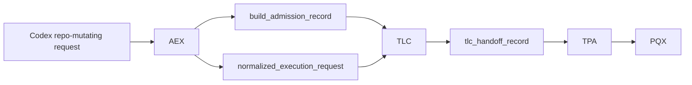

# System Registry (Canonical)

## Core Rule
1. **Single-responsibility ownership:** each governed responsibility has exactly one owning system.
2. **No-duplication rule:** no system may implement, enforce, or silently shadow a responsibility owned by another system.
3. **Support-only rule:** support code and utilities may assist owners but must never act as authority owners.

## Canonical Runtime Source of Truth
- Canonical ownership definitions are authored in this document.
- Runtime enforcement source of truth is the normalized artifact at `contracts/examples/system_registry_artifact.json`.
- The normalized artifact **MUST** be generated/validated through `scripts/build_system_registry_artifact.py`.
- Canonical repair sequence is: **canonicalize → validate → enforce → bounded repair → escalate**.

These rules are hard boundaries for architecture, contracts, and validation.

## Canonical Governed Execution Hierarchy

The governed execution hierarchy is:

**slice → batch → umbrella → roadmap**

### Slice
- Atomic unit of work.
- Executed by PQX.
- Reviewed by RQX.
- Fixes gated by TPA.

### Batch
- Aggregation of slices representing one coherent system seam.
- Must contain multiple slices.
- Ends with:
  - validation
  - review
  - `batch_decision_artifact`

### Umbrella
- Aggregation of batches representing a system phase.
- Must contain multiple batches.
- Ends with:
  - `umbrella_decision_artifact`

### Batch Constraint
A batch **MUST** contain ≥2 slices.
If a batch contains only one slice, it is invalid and must be collapsed into a slice.

### Umbrella Constraint
An umbrella **MUST** contain ≥2 batches.
If an umbrella contains only one batch, it is invalid and must be collapsed into a batch.

### Invariant
All hierarchy levels must aggregate real work. No level may act as a pass-through wrapper.

### BRF + Umbrella execution alignment
- Batch execution flow:
  - Slices → Test → Review → Decision → (Fix or Advance)
- Umbrella execution flow:
  - Batch → Decision
  - Batch → Decision
  - → Umbrella Decision
- No batch advances without:
  - validation
  - review
  - decision artifact
- No umbrella advances without:
  - all batches completed
  - umbrella decision artifact

### Execution Hierarchy Ownership Clarification
- Slice execution → PQX
- Review loop → RQX
- Fix gating → TPA
- Orchestration → TLC
- Roadmap execution control → RDX
- Closure / readiness / promotion → CDE

Batch and umbrella decision artifacts:
- control execution progression only
- **MUST NOT** represent closure, readiness, or promotion authority
- **MUST NOT** substitute for CDE decisions

CDE is the only system allowed to emit:
- `closure_decision_artifact`
- `promotion_readiness_decision`
- `readiness_to_close`

## System Map
- **AEX** — admission and execution exchange boundary for repo-mutating Codex requests
- **PQX** — bounded execution engine
- **HNX** — stage harness (structure + time/continuity semantics)
- **LCE** — lifecycle transition enforcement surface for governed artifacts *(placeholder; control-plane seam)*
- **TPA** — trust/policy application gate on execution inputs and paths
- **MAP** — review artifact mediation and projection bridge
- **RDX** — roadmap selection and execution-loop governance adapter
- **ABX** — artifact bus exchange surface for cross-module artifact transfer *(placeholder; orchestration seam)*
- **DBB** — data backbone surface for canonical metadata/lineage/evaluation/work-item records *(placeholder; shared substrate seam)*
- **FRE** — failure diagnosis and repair planning
- **RIL** — review interpretation and integration
- **RQX** — bounded review queue execution and bounded fix-slice request emission
- **SEL** — enforcement and fail-closed control actions
- **CDE** — closure-state decision authority
- **TLC** — top-level orchestration and routing across subsystems
- **PRG** — program-level planning, priority, and governance
- **RSM** — reconciliation state manager for desired-vs-actual state artifacts (non-authoritative planning support)
- **DEM** — decision economics modeler for recommendation-grade tradeoff scoring (non-authoritative)
- **MCL** — memory compaction layer for retention, archival, and entropy control artifacts (non-authoritative)
- **BRM** — blast radius manager for impact/irreversibility classification artifacts (non-authoritative)
- **DCL** — doctrine compilation layer for durable doctrine lifecycle artifacts (non-authoritative to policy authority)
- **XRL** — external reality loop for outcome normalization, trust weighting, and calibration bindings (non-authoritative)
- **SAL** — source authority layer for deterministic source precedence and obligation indexing *(placeholder; non-authoritative governance seam)*
- **SAS** — source authority sync ingestion surface *(placeholder; source retrieval seam)*
- **SHA** — shared authority layer for shared primitive ownership boundaries *(placeholder; shared primitive seam)*
- **RAX** — bounded runtime candidate-signal surface *(placeholder; non-authoritative by design)*
- **SIV** — not currently present in this repository scope (reserved acronym)
- **CHX** — chaos harness for controlled failure injection and adversarial campaign artifacts
- **DEX** — decision explainability reconstruction and consistency checking artifacts
- **SIM** — candidate policy/scenario simulation engine (non-live, non-authoritative)
- **PRX** — precedent retrieval/scoring memory layer (non-authoritative)
- **CVX** — cross-run consistency validation and instability classification
- **HIX** — governed human interaction protocol and audit exchange (non-authoritative to HIT override ownership)
- **CAL** — calibration layer for confidence/correctness drift and budget signals (non-authoritative)
- **POL** — policy lifecycle/canary/error-budget governance (non-authoritative to live TPA decisions)
- **AIL** — artifact intelligence indexing and derived trend/recommendation deltas
- **SCH** — schema compatibility/migration/staleness governance
- **DEP** — dependency-aware reliability validation across critical chains
- **RCA** — evidence-grounded root-cause attribution and failure graph artifacts
- **QOS** — queue/backpressure/retry-budget load governance signaling
- **SIMX** — external simulation provenance and replay integrity hardening
- **JDX** — first-class judgment artifact governance between interpreted evidence and control decisions
- **RUX** — reuse governance recording, boundary enforcement, and freshness/scope validation
- **XPL** — artifact-card explainability signal governance for limitations and risk posture
- **REL** — release engineering governance for canary, freeze, and rollback semantics
- **DAG** — dependency graph governance for declaration integrity, cycles, and critical-path signals
- **EXT** — external runtime governance for provenance, replay verification, and constraint enforcement
- **CTX** — context bundle governance and preflight gate authority
- **EVL** — required evaluation registry and evaluation gate authority
- **OBS** — observability contract and completeness authority
- **LIN** — lineage completeness and promotion lineage gate authority
- **DRT** — drift signal emission and aggregation authority
- **DRX** — drift response planning and governed remediation coordination artifacts
- **SLO** — error-budget and burn-rate control authority
- **DAT** — evaluation dataset registry and lineage authority
- **JSX** — judgment lifecycle/state governance and supersession records
- **PRM** — prompt registry and version admissibility authority
- **ROU** — routing observability and route-governance authority
- **HIT** — human override/correction artifact authority
- **CAP** — cost/latency/capacity budget governance authority
- **SEC** — guardrail-to-control integration authority
- **REP** — replay integrity and replay gating authority
- **ENT** — entropy accumulation and correction-mining governance authority
- **CON** — interface contract hardening authority

## Recurring Cross-System Phase Labels (Non-Owner)

### MNT — Maintain / Cross-System Trust Integration
- **classification:** recurring phase label (not a canonical system owner)
- **purpose:** post-owner platform hardening and trust-integration maintenance across existing canonical owners.
- **may coordinate roadmap groups for:**
  - cross-system evidence chains
  - certification bundle unification
  - end-to-end replay validation
  - observability completeness checks
  - exploit recurrence mining
  - drift/debt signal generation
  - supersession/retirement discipline
  - simplification/de-duplication passes
  - maintain-stage mechanics
- **must_not_do:**
  - become a new authority owner
  - override canonical ownership boundaries
  - execute work directly
  - issue policy decisions
  - issue closure decisions
  - issue enforcement actions

## System Definitions

### AEX
- **acronym:** `AEX`
- **full_name:** Admission & Execution eXchange
- **role:** Canonical entry point for all Codex execution requests that may mutate repository state.
- **owns:**
  - execution_admission
  - request_validation
  - execution_classification
  - intake_artifact_creation
  - entrypoint_enforcement
- **consumes:**
  - codex_build_request
  - system context needed for request normalization
- **produces:**
  - build_admission_record
  - normalized_execution_request
  - admission_rejection_record
- **must_not_do:**
  - execute work (PQX-owned)
  - orchestrate workflows (TLC-owned)
  - make trust/policy decisions (TPA-owned)
  - evaluate outputs (RQX/RIL/FRE-owned)
  - issue closure-state decisions (CDE-owned)
  - enforce runtime actions directly (SEL-owned)

### PQX
- **acronym:** `PQX`
- **full_name:** Prompt Queue Execution
- **role:** Executes bounded authorized work slices.
- **owns:**
  - execution
  - execution_state_transitions
  - execution_trace_emission
- **consumes:**
  - codex_pqx_task_wrapper
  - tpa_slice_artifact
  - top_level_conductor_run_artifact
- **produces:**
  - pqx_slice_execution_record
  - pqx_bundle_execution_record
  - pqx_execution_closure_record
- **must_not_do:**
  - perform trust-policy adjudication (TPA-owned)
  - perform failure diagnosis/repair generation (FRE-owned)
  - issue closure-state decisions (CDE-owned)

### HNX
- **acronym:** `HNX`
- **full_name:** Harness eXecution Semantics
- **role:** Owns canonical stage structure and time/continuity semantics for governed workflows.
- **owns:**
  - stage structure semantics
  - checkpoint/resume/async continuity constraints
  - harness-level execution preconditions
- **consumes:**
  - stage_contract
  - checkpoint_contract
  - resume_handoff_contract
- **produces:**
  - stage_continuity_evaluation
  - continuation_contract_validation_record
  - hnx_continuity_guard_result
- **must_not_do:**
  - execute work (PQX-owned)
  - make promotion decisions (CDE/SEL-owned)
  - replace policy allow/deny authority (policy modules + SEL-owned)

### MAP
- **acronym:** `MAP`
- **full_name:** Mediation and Projection
- **role:** Performs mediation/projection formatting only for governed artifacts that are already semantically interpreted by RIL.
- **owns:**
  - mediation_projection_formatting
- **consumes:**
  - review_integration_packet_artifact
  - review_projection_bundle_artifact
- **produces:**
  - mediated_review_projection_artifact
  - projection_view_bundle
- **must_not_do:**
  - reinterpret review semantics (RIL-owned)
  - perform review-loop execution (RQX-owned)
  - make closure or promotion decisions (CDE-owned)

### RDX
- **acronym:** `RDX`
- **full_name:** Roadmap Decision eXchange
- **role:** Governs roadmap-selected batch sequencing and execution-loop readiness handoff.
- **owns:**
  - roadmap_selection_governance
  - batch_sequence_governance
  - execution_loop_readiness_handoff
- **consumes:**
  - roadmap_artifact
  - roadmap_signal_bundle
  - cycle_manifest
- **produces:**
  - roadmap_selection_record
  - execution_loop_readiness_record
  - roadmap_handoff_artifact
- **must_not_do:**
  - execute bounded work (PQX-owned)
  - enforce runtime blocks (SEL-owned)
  - issue closure-state authority decisions (CDE-owned)

### LCE
- **acronym:** `LCE`
- **full_name:** Lifecycle Control Enforcement
- **role:** Placeholder control-plane subsystem for canonical artifact lifecycle transition validation and transition gating.
- **status:** Placeholder (non-authoritative outside lifecycle transition checks)
- **owns:**
  - lifecycle_state_transition_validation
  - transition_required_field_enforcement
  - lifecycle_transition_rejection_on_invalid_state
- **consumes:**
  - lifecycle_state_artifact
  - lifecycle_transition_request
  - evaluation_and_work_item_linkage_artifacts
- **produces:**
  - lifecycle_transition_validation_result
  - lifecycle_violation_record
  - lifecycle_transition_acceptance_record
- **must_not_do:**
  - execute work slices (PQX-owned)
  - reinterpret policy admissibility (TPA-owned)
  - issue closure-state authority decisions (CDE-owned)

### ABX
- **acronym:** `ABX`
- **full_name:** Artifact Bus eXchange
- **role:** Placeholder orchestration subsystem for governed cross-module artifact transfer messaging and transfer validation.
- **status:** Placeholder (non-authoritative transfer seam)
- **owns:**
  - cross_module_artifact_transfer_envelope
  - transfer_message_validation
  - run_linked_handoff_trace_requirements
- **consumes:**
  - source_module_artifact
  - orchestration_flow_definition
  - module_manifest_io_contracts
- **produces:**
  - artifact_bus_message
  - rejected_transfer_record
  - transfer_lineage_link
- **must_not_do:**
  - reinterpret review semantics (RIL-owned)
  - execute work slices (PQX-owned)
  - issue trust/policy admissibility decisions (TPA-owned)

### DBB
- **acronym:** `DBB`
- **full_name:** Data Backbone
- **role:** Placeholder shared-data subsystem defining canonical metadata, lineage, evaluation, and work-item record surfaces for governed artifacts.
- **status:** Placeholder (shared substrate; authority remains with canonical system owners)
- **owns:**
  - canonical_artifact_metadata_shape
  - canonical_lineage_record_shape
  - canonical_evaluation_record_shape
  - canonical_work_item_record_shape
- **consumes:**
  - artifact_emission_records
  - lineage_references
  - evaluation_and_work_item_records
- **produces:**
  - governed_metadata_record
  - governed_lineage_record
  - governed_evaluation_record
  - governed_work_item_record
- **must_not_do:**
  - execute work slices (PQX-owned)
  - decide closure/readiness states (CDE-owned)
  - enforce runtime actions (SEL-owned)

### TPA
- **acronym:** `TPA`
- **full_name:** Trust Policy Application
- **role:** Determines trust/policy admissibility and required execution scope before work runs.
- **owns:**
  - trust_policy_application
  - scope_gating
  - complexity_budgeting
- **consumes:**
  - codex_pqx_task_wrapper
  - source_authority_refresh_receipt
  - complexity_trend
- **produces:**
  - tpa_scope_policy
  - tpa_slice_artifact
  - tpa_observability_summary
- **must_not_do:**
  - execute work slices (PQX-owned)
  - enforce runtime actions directly (SEL-owned)
  - perform closure decisioning (CDE-owned)

### FRE
- **acronym:** `FRE`
- **full_name:** Failure Recovery Engine
- **role:** Diagnoses bounded failures and emits governed repair plans.
- **owns:**
  - failure_diagnosis
  - repair_plan_generation
  - recurrence_prevention_recommendation
- **consumes:**
  - agent_failure_record
  - system_enforcement_result_artifact
  - review_signal_artifact
- **produces:**
  - failure_diagnosis_artifact
  - repair_prompt_artifact
  - recurrence_prevention_record
- **must_not_do:**
  - execute repairs directly (PQX-owned)
  - mutate policy/enforcement state directly (SEL-owned)
  - emit final closure decisions (CDE-owned)

### RIL
- **acronym:** `RIL`
- **full_name:** Review Integration Layer
- **role:** Interprets review outputs into deterministic integration packets and projections.
- **owns:**
  - review_interpretation
  - review_integration
  - review_projection
  - evaluation_interpretation
  - drift_interpretation
  - control_input_interpretation_support
- **consumes:**
  - review_artifact
  - review_signal_artifact
  - review_action_tracker_artifact
- **produces:**
  - review_integration_packet_artifact
  - review_projection_bundle_artifact
  - roadmap_review_projection_artifact
- **must_not_do:**
  - enforce policy decisions (SEL-owned)
  - execute work or repairs (PQX-owned)
  - generate repair plans (FRE-owned)
  - prioritize adoption candidates (PRG-owned)
  - issue policy authority decisions (TPA-owned)
  - decide closure state (CDE-owned)

### RQX
- **acronym:** `RQX`
- **full_name:** Review Queue Executor
- **role:** Executes the bounded review loop over completed execution batches and emits governed review outcomes and bounded fix-slice requests.
- **owns:**
  - review_queue_execution
  - merge_readiness_verdict_emission
  - bounded_fix_slice_request_emission
  - unresolved_post_cycle_operator_handoff_emission
- **consumes:**
  - pqx_bundle_execution_record
  - pqx_slice_execution_record
  - review_request_artifact
  - review_result_artifact
  - validation/test result artifacts
- **produces:**
  - review_result_artifact
  - review_merge_readiness_artifact
  - review_fix_slice_artifact
  - review_operator_handoff_artifact
- **must_not_do:**
  - reinterpret review semantics already owned by RIL
  - own review interpretation semantics (RIL-owned)
  - execute fix slices directly (PQX-owned)
  - perform deep repair diagnosis/planning (FRE-owned)
  - own repair diagnosis/planning responsibilities (FRE-owned)
  - enforce runtime blocks directly (SEL-owned)
  - issue closure-state authority decisions (CDE-owned)

### SEL
- **acronym:** `SEL`
- **full_name:** System Enforcement Layer
- **role:** Enforces hard gates and fail-closed actions across subsystem boundaries.
- **owns:**
  - enforcement
  - fail_closed_blocking
  - promotion_guarding
- **consumes:**
  - tpa_slice_artifact
  - review_control_signal_artifact
  - closure_decision_artifact
- **produces:**
  - system_enforcement_result_artifact
  - enforcement_decision
  - action_trace_record
- **must_not_do:**
  - reinterpret review payload semantics (RIL-owned)
  - reinterpret policy admissibility semantics (TPA-owned)
  - generate repair plans (FRE-owned)
  - orchestrate workflow routing (TLC-owned)

### CDE
- **acronym:** `CDE`
- **full_name:** Closure Decision Engine
- **role:** Sole authoritative owner for closure-state and readiness-to-close decisions from governed evidence.
- **owns:**
  - closure_decisions
  - closure_lock_state
  - bounded_next_step_classification
  - promotion_readiness_decisioning
- **consumes:**
  - review_projection_bundle_artifact
  - review_signal_artifact
  - review_action_tracker_artifact
- **produces:**
  - cde_control_decision_output
  - closure_decision_artifact
- **must_not_do:**
  - execute work (PQX-owned)
  - enforce policy side effects (SEL-owned)
  - generate repair plans (FRE-owned)

### TLC
- **acronym:** `TLC`
- **full_name:** Top Level Conductor
- **role:** Orchestrates subsystem invocation order, cross-system routing, and bounded non-authoritative handoff disposition classification.
- **owns:**
  - orchestration
  - subsystem_routing
  - bounded_cycle_coordination
  - unresolved_handoff_disposition_classification
- **consumes:**
  - build_admission_record
  - normalized_execution_request
  - tlc_handoff_record
  - tpa_slice_artifact
  - system_enforcement_result_artifact
  - closure_decision_artifact
  - review_result_artifact
  - review_merge_readiness_artifact
  - review_operator_handoff_artifact
  - review_handoff_disposition_artifact
- **produces:**
  - tlc_handoff_record
  - top_level_conductor_run_artifact
  - review_handoff_disposition_artifact
- **must_not_do:**
  - execute work slice internals (PQX-owned)
  - perform repair diagnosis/planning (FRE-owned)
  - substitute closure authority (CDE-owned)
  - perform policy admissibility evaluation (TPA-owned)
  - perform review interpretation (RIL-owned)
  - own admission validation authority (AEX-owned)
  - own promotion readiness or closure decision authority (CDE-owned)

### PRG
- **acronym:** `PRG`
- **full_name:** Program Governance
- **role:** Owns program-level objective framing, roadmap alignment, and progress governance.
- **owns:**
  - program_governance
  - roadmap_alignment
  - program_drift_management
  - evaluation_pattern_aggregation
  - recommendation_generation
  - adoption_candidate_prioritization
  - adaptive_readiness_recommendation
- **consumes:**
  - roadmap_signal_bundle
  - roadmap_review_view_artifact
  - batch_delivery_report
- **produces:**
  - program_brief
  - program_feedback_record
  - evaluation_pattern_report
  - policy_change_candidate
  - slice_contract_update_candidate
  - program_alignment_assessment
  - prioritized_adoption_candidate_set
  - adaptive_readiness_record
  - program_roadmap_alignment_result
- **must_not_do:**
  - execute bounded work (PQX-owned)
  - gate execution admission (AEX/TPA-owned)
  - enforce runtime blocks (SEL-owned)
  - interpret review integration packets (RIL-owned)
  - issue closure authority decisions (CDE-owned)
  - issue policy authority decisions (TPA-owned)
  - influence runtime execution authority or admission decisions (PQX/AEX-owned)

### RSM
- **acronym:** `RSM`
- **full_name:** Reconciliation State Manager
- **role:** Compares desired vs actual state, classifies divergence, and emits non-authoritative reconciliation artifacts.
- **owns:**
  - desired_state_artifact
  - actual_state_artifact
  - state_delta_artifact
  - divergence_record
  - state_alignment_status
  - reconciliation_plan_artifact
  - portfolio_state_snapshot
- **consumes:**
  - interpreted artifacts and state-ready surfaces
  - module posture
  - operator posture
  - policy/judgment/override state
  - portfolio posture signals
- **must_not_do:**
  - decide next-step authority (CDE-owned)
  - enforce actions (SEL-owned)
  - execute work (PQX-owned)
  - apply policy (TPA-owned)
  - reinterpret raw evidence semantics (RIL-owned)

### DEM
- **acronym:** `DEM`
- **full_name:** Decision Economics Modeler
- **role:** Quantifies economic tradeoffs and emits recommendation-grade decision economics artifacts.
- **owns:**
  - decision_economics_artifact
  - cost_of_delay_model
  - false_positive_cost_model
  - false_negative_cost_model
  - human_review_cost_model
  - tradeoff_surface_artifact
  - economic_decision_score
- **must_not_do:**
  - decide next-step authority (CDE-owned)
  - enforce actions (SEL-owned)
  - execute work (PQX-owned)

### MCL
- **acronym:** `MCL`
- **full_name:** Memory Compaction Layer
- **role:** Governs memory compaction, archival tiering, entropy reduction, and retention artifacts.
- **owns:**
  - memory_compaction_plan
  - archival_tier_assignment
  - retention_policy_artifact
  - memory_entropy_report
  - canonical_memory_promotion_candidate
  - archive_prune_record
- **must_not_do:**
  - decide active policy or closure authority
  - override active-set rules owned elsewhere
  - execute deletion outside canonical governance

### BRM
- **acronym:** `BRM`
- **full_name:** Blast Radius Manager
- **role:** Classifies blast radius, irreversibility, rollback difficulty, and escalation requirements.
- **owns:**
  - blast_radius_assessment
  - irreversibility_classification
  - rollback_difficulty_score
  - escalation_requirement_record
  - multi_review_requirement_record
- **must_not_do:**
  - decide final authority (CDE-owned)
  - enforce directly (SEL-owned)

### DCL
- **acronym:** `DCL`
- **full_name:** Doctrine Compilation Layer
- **role:** Compiles stable judgments/policies/precedents into doctrine lifecycle artifacts with lineage and conflicts.
- **owns:**
  - doctrine_artifact
  - doctrine_update_candidate
  - doctrine_supersession_record
  - doctrine_conflict_record
  - doctrine_lineage_record
- **must_not_do:**
  - act as policy authority by itself
  - override TPA/CDE/SEL ownership
  - silently elevate commentary into doctrine

### XRL
- **acronym:** `XRL`
- **full_name:** External Reality Loop
- **role:** Ingests and normalizes external outcomes, computes trust weighting, and binds outcomes into calibration/eval loops.
- **owns:**
  - external_outcome_signal
  - outcome_normalization_record
  - outcome_trust_weight
  - external_feedback_binding_record
  - external_outcome_impact_artifact
- **must_not_do:**
  - directly update policy/judgment/closure without canonical paths

### SAL
- **acronym:** `SAL`
- **full_name:** Source Authority Layer
- **role:** Placeholder governance subsystem for deterministic source-authority precedence and source-obligation index surfaces.
- **status:** Placeholder (non-authoritative source-governance surface)
- **owns:**
  - source_authority_precedence_rules
  - source_inventory_index_requirements
  - source_obligation_index_requirements
- **consumes:**
  - source_structured_artifact
  - source_inventory_record
  - obligation_index_record
- **produces:**
  - source_authority_validation_result
  - source_authority_precedence_record
  - source_obligation_trace_record
- **must_not_do:**
  - execute bounded work slices (PQX-owned)
  - issue trust/policy admissibility decisions (TPA-owned)
  - issue closure/promotion decisions (CDE-owned)

### SAS
- **acronym:** `SAS`
- **full_name:** Source Authority Sync
- **role:** Placeholder ingestion subsystem for deterministic retrieve/materialize/index of project-design source artifacts.
- **status:** Placeholder (retrieve/index seam; non-authoritative for downstream decisions)
- **owns:**
  - source_retrieve_sync_execution
  - source_materialization_rules
  - source_sync_completeness_validation
- **consumes:**
  - upstream_source_repository_content
  - source_sync_configuration
  - required_source_manifest
- **produces:**
  - source_raw_copy_record
  - source_structured_artifact
  - source_sync_validation_report
- **must_not_do:**
  - issue closure/readiness decisions (CDE-owned)
  - bypass source precedence rules (SAL-owned)
  - execute repo mutation outside admitted orchestration paths (AEX/TLC-owned)

### SHA
- **acronym:** `SHA`
- **full_name:** Shared Authority
- **role:** Placeholder boundary subsystem defining exclusive ownership for shared primitives used across modules.
- **status:** Placeholder (boundary-definition seam; non-execution subsystem)
- **owns:**
  - shared_primitive_ownership_boundary
  - shared_primitive_redefinition_prohibition
  - shared_layer_manifest_requirements
- **consumes:**
  - module_manifest
  - shared_primitive_definition
  - architecture_boundary_rules
- **produces:**
  - shared_authority_compliance_result
  - shared_boundary_violation_record
  - shared_ownership_reference_map
- **must_not_do:**
  - execute bounded work slices (PQX-owned)
  - perform orchestration routing (TLC-owned)
  - issue closure-state authority decisions (CDE-owned)

### RAX
- **acronym:** `RAX`
- **full_name:** Runtime Assurance eXchange
- **role:** Bounded runtime candidate-signal surface emitting non-authoritative readiness, feedback-loop, and assurance artifacts.
- **status:** Placeholder (explicitly non-authoritative runtime interface)
- **owns:**
  - rax_candidate_signal_emission
  - rax_eval_surface_artifact_emission
  - rax_feedback_loop_trace_linkage
- **consumes:**
  - eval_result
  - eval_summary
  - runtime_trace_evidence
- **produces:**
  - rax_failure_pattern_record
  - rax_failure_eval_candidate
  - rax_feedback_loop_record
  - rax_health_snapshot
  - rax_drift_signal_record
  - rax_unknown_state_record
  - rax_pre_certification_alignment_record
  - rax_control_readiness_record
- **must_not_do:**
  - issue closure, readiness-to-close, or promotion authority decisions (CDE-owned)
  - enforce runtime block/unblock decisions directly (SEL-owned)
  - execute bounded work slices (PQX-owned)

## Control-Prep Artifact Rule (Non-Authoritative)
- The following artifacts are **preparatory only** and **MUST NOT** be treated as authoritative decisions:
  - `control_signal_fusion_record`
  - `prioritized_adoption_candidate_set`
  - `cde_control_decision_input`
  - `tpa_policy_update_input`
  - `control_prep_readiness_record`
- These preparatory artifacts may:
  - fuse signals
  - rank bounded options
  - prepare future authority inputs
  - assess readiness for a future governed cycle
- These preparatory artifacts must **NOT**:
  - authorize closure
  - authorize enforcement
  - authorize policy application
  - substitute for CDE outputs
  - substitute for TPA outputs

## Learning / Detection / Recommendation Artifact Ownership
| Artifact | Canonical owner | Constraint |
| --- | --- | --- |
| `evaluation_summary_artifact` | RIL | Interpretation artifact only; non-authoritative. |
| `execution_observability_artifact` | RIL | Observation/interpretation only; no execution mutation authority. |
| `drift_detection_record` | RIL | Detection artifact only; no direct runtime action. |
| `slice_failure_pattern_record` | RIL | Pattern interpretation only; no repair execution authority. |
| `evaluation_pattern_report` | PRG | Recommendation input only; non-authoritative. |
| `policy_change_candidate` | PRG | Candidate artifact only; requires TPA authority output before policy application. |
| `slice_contract_update_candidate` | PRG | Candidate artifact only; no direct execution effect. |
| `program_alignment_assessment` | PRG | Governance assessment only; non-authoritative for closure/enforcement. |
| `program_roadmap_alignment_result` | PRG | Program alignment output only; no closure authority. |
| `adaptive_readiness_record` | PRG | Recommendation artifact only; cannot substitute for CDE closure/readiness decisions. |

## CDE/TPA Authority Boundary: Prep vs Authority
- **CDE boundary**
  - `cde_control_decision_input` is a non-authoritative preparatory artifact.
  - CDE decision outputs (including `closure_decision_artifact` and `cde_control_decision_output`) are authoritative.
- **TPA boundary**
  - `tpa_policy_update_input` is a non-authoritative preparatory artifact.
  - TPA policy outputs (`allow`, `reject`, `narrow`, `evidence_required`) are authoritative.
- Preparatory artifacts may be consumed by future governed cycles, but may not be treated as authority artifacts themselves.

## Anti-Duplication Table
| Invalid behavior | Why invalid | Canonical owner |
| --- | --- | --- |
| TLC executes work | Orchestration cannot subsume execution responsibility | PQX |
| CDE generates repairs | Closure authority cannot create remediation plans | FRE |
| RIL enforces decisions | Interpretation cannot trigger hard gates | SEL |
| PRG executes work | Program governance cannot run execution slices | PQX |
| SEL rewrites review interpretation | Enforcement cannot reinterpret evidence semantics | RIL |
| SEL rewrites policy interpretation | Enforcement cannot become a second policy engine | TPA |
| TPA emits closure decisions | Trust policy gating cannot decide closure lock state | CDE |
| RQX executes fix slices | Review queue execution cannot subsume execution authority | PQX |
| RQX reinterprets review semantics | Review queue execution cannot redefine review interpretation semantics | RIL |
| RQX generates full repair diagnosis | Bounded review queue execution cannot replace diagnosis/planning ownership | FRE |
| RQX enforces runtime decisions | Review queue execution cannot enforce runtime blocks | SEL |
| RQX issues authoritative closure state | Review queue execution cannot become closure authority | CDE |
| TLC performs admission validation | Orchestrator must not own repo-mutation admission | AEX |
| PQX accepts repo-writing requests directly | Execution system cannot be public repo-write entrypoint | AEX |
| AEX executes work | Admission boundary cannot execute bounded work | PQX |
| AEX decides trust/policy admissibility | Admission boundary cannot own trust-policy authority | TPA |
| PRG emits authoritative closure or gating decisions | Recommendation/planning cannot become decision authority | CDE / TPA |
| RIL ranks adoption candidates | Interpretation layer cannot own program prioritization | PRG |
| TLC emits control decisions from prep artifacts | Orchestration cannot convert preparatory inputs into authority outputs | CDE / TPA |
| Control-prep artifacts treated as final decisions | Preparatory artifacts cannot substitute for authority decisions | CDE / TPA |
| Drift detection directly changes runtime behavior | Detection cannot directly mutate runtime behavior outside governed authority paths | TPA / SEL / PQX via governed cycle |
| RSM issues closure/promotion decisions | Reconciliation is preparatory; closure authority remains canonical | CDE |
| DEM emits enforcement decisions | Economics is recommendation-grade only | SEL / CDE |
| DCL activates policy directly | Doctrine compilation cannot bypass policy authority | TPA |
| XRL writes policy/judgment/closure directly | External outcomes must route through canonical consumers | TPA / CDE / RIL |
| BRM executes freezes/enforcement directly | Blast classification cannot become enforcement action | SEL / CDE |
| MCL deletes governed memory directly | Compaction must remain governed and auditable | SEL / CDE / policy owners |

## Allowed Interaction Graph
- AEX → TLC
- TLC → PQX
- TLC → TPA
- TLC → FRE
- TLC → RIL
- TLC → RQX
- TLC → CDE
- TLC → PRG
- SEL wraps all subsystems as a cross-cutting enforcement boundary
- RQX → RIL
- RQX → FRE
- RQX → TPA (review fix slices must be policy-gated before execution)
- TPA → PQX (only approved tpa_slice_artifact may enter execution)
- RQX → PQX (handoff only via TPA-approved artifacts; no direct execution)
- RQX → TLC (operator handoff disposition classification only; no auto-recursion)
- TLC → review_handoff_disposition_artifact (classification output only; no execution trigger and no closure authority)
- CDE → closure_decision_artifact (readiness-to-close / bounded-next-step / promotion-readiness decisions)
- RIL → CDE
- RIL → RSM (interpreted state inputs)
- RSM → PRG (portfolio divergence and debt signals)
- RSM → CDE (non-authoritative reconciliation inputs)
- DEM → PRG (economic tradeoff recommendations)
- BRM → CDE (blast/irreversibility support artifacts)
- DCL → TPA (doctrine-derived policy candidate inputs)
- DCL → PRG (doctrine posture summaries)
- XRL → RIL (external outcome normalization bindings)
- XRL → PRG (outcome impact trend signals)
- MCL → RSM (compacted memory posture summaries)
- Placeholder seams (LCE/ABX/DBB/SAL/SAS/SHA/RAX) are non-authoritative and must route final authority decisions through canonical owners above.

## Entry Invariant (Repo-Mutation Admission)
- All Codex execution requests that create or modify repository state MUST enter through **AEX**.
- **AEX** is the only system allowed to invoke **TLC** for repo-mutating work.
- **TLC** MUST validate `build_admission_record` and `normalized_execution_request` (accepted status, repo-write class, resolvable request reference, and trace continuity) before orchestration continues.
- **TLC** MUST formalize admitted repo-write continuation as `tlc_handoff_record` before routing to downstream execution gates.
- **PQX** MUST reject repo-writing execution that lacks AEX admission artifacts plus TLC-mediated lineage.
- `build_admission_record`, `normalized_execution_request`, and `tlc_handoff_record` MUST each include verifiable `authenticity` attestation (issuer, key_id, payload digest, and attestation) and MUST be verified fail-closed at the PQX repo-write lineage boundary.
- Any attempt to invoke **TLC** or **PQX** directly for repo-mutating work without valid AEX/TLC lineage MUST fail closed.

## Pre-PR bounded repair-loop behavior (GHA-008)
- This is a **behavior** over existing systems, not a new system.
- Ownership mapping is fixed:
  - RIL structures failure/test surfaces into governed packets only.
  - FRE diagnoses failure class, emits `failure_repair_candidate_artifact`, and proposes bounded repair scope.
  - CDE is the only authority that may emit `continue_repair_bounded`.
  - TLC only orchestrates bounded retries and terminal-state transitions.
  - PQX is the only execution path for applying repairs and rerunning tests.
  - SEL enforces scope, retry budget, and decision-state boundaries for each repair attempt.

## Serial Multi-Umbrella Execution Rule
- When multiple umbrellas are executed in one governed serial cycle:
  - each umbrella **MUST** fully complete before the next umbrella begins
  - each umbrella **MUST** emit its own `umbrella_decision_artifact`
  - later umbrellas may consume prior umbrella outputs
  - later umbrellas **MUST NOT** mutate prior umbrella outputs
  - any fail-closed stop condition halts the serial cycle unless a bounded permitted fix cycle is explicitly invoked

## Roadmap Design Rules (Registry Alignment Constitution)
1. Every roadmap row **MUST** map to one canonical system owner from this registry.
2. No roadmap row may assign a responsibility to a non-owner.
3. Preparatory rows that produce future authority inputs **MUST** be labeled non-authoritative.
4. Decision rows **MUST** invoke the authoritative decision owner (CDE/TPA), never a recommendation/prep layer.
5. Execution rows **MUST** route execution through PQX.
6. Enforcement rows **MUST** route enforcement through SEL.
7. Repo-mutating rows **MUST** preserve lineage `AEX → TLC → TPA → PQX`.
8. Review-related rows **MUST** distinguish:
   - RQX review-loop execution
   - RIL interpretation/projection
9. Roadmaps **MUST** separate:
   - observe / interpret / recommend / prepare
   - decide / gate / enforce / execute
10. Multi-umbrella roadmap bundles **MUST** preserve complete per-umbrella completion boundaries.
11. Batch and umbrella decision artifacts control progression only and **MUST NOT** substitute for CDE closure authority.
12. New roadmap proposals **MUST** be duplication-checked against this registry before admission.
13. RSM/DEM/MCL/BRM/DCL/XRL outputs are preparatory/recommendation-grade and MUST route authority transitions through canonical CDE/TPA/SEL paths.

## System Invariants
1. Execution is owned only by **PQX**.
2. Recovery and repair planning are owned only by **FRE**.
3. Review interpretation is owned only by **RIL**.
4. Closure decisions are owned only by **CDE**.
5. Enforcement is owned only by **SEL**.
6. Orchestration is owned only by **TLC**.
7. Program governance is owned only by **PRG**.
8. Review-loop execution is owned only by **RQX**.
9. Repo-mutation admission is owned only by **AEX**.

## Roadmap Alignment Checklist (Lightweight)
- Does each roadmap row map to exactly one canonical owner?
- Is any preparatory artifact being treated as an authority artifact?
- Does any recommendation layer implicitly decide, gate, or enforce?
- Does any orchestration layer perform execution or policy reasoning?
- Are serial umbrella completion boundaries explicit?
- Are repo-mutation paths preserving `AEX → TLC → TPA → PQX` lineage?
- Are batch/umbrella decision artifacts being misused as closure authority?

## Canonical Repo-Mutation Path

## Placeholder Systems Added
- **LCE** — added because `docs/architecture/lifecycle-enforcement.md` defines a concrete lifecycle transition enforcement seam with canonical transition validation behavior.
- **ABX** — added because `docs/architecture/artifact-bus.md` defines a canonical cross-module artifact transfer surface with required message contracts.
- **DBB** — added because `docs/architecture/data-backbone.md` defines platform-wide governed artifact metadata/lineage/evaluation/work-item substrate behavior.
- **SAL** — added because `docs/architecture/source_authority_layer.md` defines canonical source-authority precedence and index-governance behavior used by roadmap/planning flows.
- **SAS** — added because `docs/architecture/source_authority_sync.md` defines deterministic retrieve/materialize/index behavior with fail-closed completeness checks.
- **SHA** — added because `docs/architecture/shared-authority.md` defines shared primitive ownership boundaries and prohibited redefinition behavior across modules.
- **RAX** — added because this registry already used RAX as a governed runtime boundary and multiple architecture/review surfaces rely on its candidate artifact seam; full definition added to resolve missing registry entry.

## Budget Signal Extension (2026-04-13)

### BAX
- **acronym:** `BAX`
- **full_name:** `Budget Aggregation eXchange`
- **role:** Aggregates SLO/CAP/QOS budget telemetry into a merged non-authoritative signal for downstream canonical authorities.
- **owns:**
  - merged_budget_signal
  - budget_signal_consistency_record
  - budget_signal_bundle
- **must_not_do:**
  - issue_closure_or_promotion_decisions
  - issue_policy_admissibility_decisions
  - enforce_runtime_actions
  - replace_SLO_CAP_QOS_ownership

### Governed topology extension
- `AEX -> TLC -> TPA -> PQX -> BAX (signal-only) -> CDE -> SEL`
- **CDE remains sole final closure-state owner.**

## Advanced System Extensions (ADV-001)

### CHX
- **acronym:** `CHX`
- **full_name:** Chaos Harness eXchange
- **role:** Owns controlled failure injection and adversarial scenario execution across governed seams.
- **owns:**
  - chaos_failure_injection
  - chaos_scenario_definition
  - chaos_campaign_execution
  - chaos_failure_surface_reporting
- **consumes:**
  - governed_scenario_inputs
  - replayable_system_bundles
  - certification_scope_inputs
- **produces:**
  - chx_injection_record
  - chx_scenario_pack
  - chx_campaign_result
  - chx_failure_surface_report
- **must_not_do:**
  - execute_production_workflows
  - replace_pqx_execution
  - issue_policy_authority
  - issue_closure_authority
  - mutate_live_state_outside_controlled_injection

### CVX
- **acronym:** `CVX`
- **full_name:** Consistency Validation eXchange
- **role:** Owns multi-run consistency comparison, divergence scoring, and instability classification.
- **owns:**
  - multi_run_comparison
  - divergence_scoring
  - instability_classification
- **consumes:**
  - repeated_run_outputs
  - replay_bundles
  - evidence_chain_artifacts
- **produces:**
  - cvx_run_comparison_record
  - cvx_consistency_score
  - cvx_instability_report
  - cvx_consistency_bundle
- **must_not_do:**
  - alter_execution_outputs
  - override_decision_authority
  - replace_replay_engines

### DEX
- **acronym:** `DEX`
- **full_name:** Decision Explainability eXchange
- **role:** Owns deterministic decision explanation reconstruction from governed evidence and prior decisions.
- **owns:**
  - decision_explanation_reconstruction
  - explanation_consistency_checking
  - explanation_compression_views
- **consumes:**
  - decision_artifacts
  - evidence_chain_artifacts
  - control_eval_artifacts
  - provenance_replay_refs
- **produces:**
  - dex_explanation_record
  - dex_explanation_consistency_result
  - dex_explanation_summary
  - dex_explanation_bundle
- **must_not_do:**
  - make_decisions
  - reinterpret_upstream_semantics
  - override_authority_paths

### SIM
- **acronym:** `SIM`
- **full_name:** Simulation eXecution Module
- **role:** Owns deterministic candidate policy and scenario simulation without live-state mutation.
- **owns:**
  - candidate_policy_simulation
  - scenario_replay_execution
  - impact_diff_generation
- **consumes:**
  - candidate_policy_artifacts
  - baseline_artifacts
  - replayable_scenario_packs
- **produces:**
  - sim_scenario_record
  - sim_policy_impact_report
  - sim_diff_record
  - sim_simulation_bundle
- **must_not_do:**
  - modify_live_state
  - replace_tpa_cde_authority
  - promote_simulation_output_automatically

### PRX
- **acronym:** `PRX`
- **full_name:** Precedent Retrieval eXchange
- **role:** Owns structured precedent record retrieval and bounded relevance scoring.
- **owns:**
  - precedent_record_storage_shape
  - precedent_retrieval
  - precedent_relevance_scoring
- **consumes:**
  - historical_decision_artifacts
  - historical_outcome_artifacts
  - evidence_bundles
- **produces:**
  - prx_precedent_record
  - prx_precedent_match_set
  - prx_precedent_score_report
  - prx_precedent_bundle
- **must_not_do:**
  - override_current_authority
  - auto_promote_historical_precedent

### HIX
- **acronym:** `HIX`
- **full_name:** Human Interaction eXchange
- **role:** Owns governed human interaction protocol contracts and interaction audit exchange (non-authoritative to HIT override ownership).
- **owns:**
  - human_action_contracts
  - override_audit_artifacts
  - human_feedback_exchange_artifacts
- **consumes:**
  - hitl_checkpoints
  - override_requests
  - structured_human_feedback_inputs
- **produces:**
  - hix_human_action_record
  - hix_override_audit_record
  - hix_feedback_exchange_record
  - hix_human_interaction_bundle
- **must_not_do:**
  - bypass_governance_layers
  - mutate_state_outside_owner_flows
  - replace_cde_tpa_sel_authority

### CAL
- **acronym:** `CAL`
- **full_name:** Calibration Layer
- **role:** Measures calibration between confidence and correctness over time for governed outputs.
- **owns:**
  - calibration_records
  - calibration_drift_monitoring
  - confidence_budget_signals
- **consumes:**
  - confidence_bearing_outputs
  - correctness_outcome_artifacts
  - historical_evaluation_results
- **produces:**
  - cal_calibration_record
  - cal_drift_report
  - cal_confidence_budget_status
  - cal_calibration_bundle
- **must_not_do:**
  - make decisions
  - replace policy or closure authority
  - alter upstream outputs

### POL
- **acronym:** `POL`
- **full_name:** Policy Lifecycle Layer
- **role:** Governs policy rollout lifecycle state and decision-quality budget tracking.
- **owns:**
  - policy_rollout_lifecycle
  - wrong_allow_wrong_block_budget_tracking
  - policy_backtesting_outputs
  - rollout_bundle_emission
- **consumes:**
  - policy_candidates
  - golden_set_evaluation_bundles
  - canary_outcomes
  - error_budget_evidence
- **produces:**
  - pol_rollout_record
  - pol_error_budget_record
  - pol_backtest_report
  - pol_policy_lifecycle_bundle
- **must_not_do:**
  - replace TPA live policy authority
  - auto-activate unsafe policies
  - bypass certification gates

### AIL
- **acronym:** `AIL`
- **full_name:** Artifact Intelligence Layer
- **role:** Indexes governed artifacts and emits deterministic intelligence jobs from governed history.
- **owns:**
  - artifact_indexes
  - derived_artifact_jobs
  - recommendation_delta_jobs
  - cluster_trend_outputs
- **consumes:**
  - artifact_graph_history
  - evaluations
  - overrides
  - drift_signals
  - certification_events
- **produces:**
  - ail_index_record
  - ail_derived_artifact_job
  - ail_trend_cluster_report
  - ail_recommendation_delta_report
  - ail_intelligence_bundle
- **must_not_do:**
  - invent authority
  - replace PRG recommendation authority
  - replace RDX sequencing authority
  - emit unsupported causal claims

### SCH
- **acronym:** `SCH`
- **full_name:** Schema Evolution Layer
- **role:** Governs backward compatibility and migration discipline for governed artifact contracts.
- **owns:**
  - schema_compatibility_validation
  - migration_records
  - stale_schema_detection
- **consumes:**
  - contract_versions
  - artifact_families
  - migration_specs
  - historical_artifacts
- **produces:**
  - sch_compatibility_result
  - sch_migration_record
  - sch_stale_schema_report
  - sch_schema_evolution_bundle
- **must_not_do:**
  - rewrite live artifacts silently
  - override contract owners

### DEP
- **acronym:** `DEP`
- **full_name:** Dependency Integrity Layer
- **role:** Performs dependency-aware reliability validation over critical multi-system chains.
- **owns:**
  - dependency_aware_test_bundles
  - chain_integrity_reports
  - dependency_regression_outputs
- **consumes:**
  - critical_path_metadata
  - chain_metadata
  - reliability_evidence
- **produces:**
  - dep_dependency_test_bundle
  - dep_chain_integrity_report
  - dep_regression_surface_report
  - dep_dependency_bundle
- **must_not_do:**
  - replace execution owners
  - replace routing owners
  - mutate production state

### RCA
- **acronym:** `RCA`
- **full_name:** Root Cause Attribution Layer
- **role:** Generates explicit causal diagnosis artifacts from correlated governed signals.
- **owns:**
  - root_cause_records
  - failure_graphs
  - attribution_bundles
- **consumes:**
  - replay_certification_observability_override_failure_signals
  - evidence_chain_artifacts
  - incident_artifacts
- **produces:**
  - rca_root_cause_record
  - rca_failure_graph
  - rca_attribution_bundle
- **must_not_do:**
  - invent unsupported causal claims
  - replace incident owners
  - replace enforcement authority

### QOS
- **acronym:** `QOS`
- **full_name:** Queue and Backpressure Governance
- **role:** Governs queue/backlog/priority/retry-budget signaling under load.
- **owns:**
  - queue_governance_records
  - backpressure_signals
  - retry_budget_records
  - load_governance_bundles
- **consumes:**
  - backlog_depth
  - queue_age
  - retry_counts
  - throughput_latency_evidence
  - error_budget_status
- **produces:**
  - qos_queue_governance_record
  - qos_backpressure_signal
  - qos_retry_budget_record
  - qos_load_governance_bundle
- **must_not_do:**
  - replace execution owners
  - silently throttle without governed signaling
  - bypass SEL/CDE/TPA where authority is required

### SIMX
- **acronym:** `SIMX`
- **full_name:** External Simulation Provenance
- **role:** Owns simulation-only provenance/replay/integrity for external simulation workflows.
- **owns:**
  - external_simulation_provenance_records
  - replayable_simulation_bundles
  - external_drift_detection_outputs
- **consumes:**
  - external_runtime_version_data
  - simulation_inputs_outputs
  - environment_provenance_captures
- **produces:**
  - simx_provenance_record
  - simx_replayable_bundle
  - simx_drift_report
  - simx_simulation_integrity_bundle
- **must_not_do:**
  - replace SIM
  - mutate external systems directly
  - trust external results without provenance validation

### JDX
- **acronym:** `JDX`
- **full_name:** Judgment Layer
- **role:** First-class governed judgment artifacts between interpreted evidence and downstream control decisions.
- **owns:**
  - judgment_artifact_requirements
  - judgment_record
  - judgment_policy_registry_artifacts
  - judgment_eval_result_artifacts
  - judgment_application_record_lineage
  - judgment_bundles
- **consumes:**
  - interpreted_evidence_artifacts
  - precedent_artifacts
  - policy_lifecycle_artifacts
  - calibration_artifacts
  - evaluation_results
  - replay_provenance_references
- **produces:**
  - jdx_judgment_record
  - jdx_judgment_policy
  - jdx_judgment_eval_result
  - jdx_judgment_application_record
  - jdx_judgment_bundle
- **must_not_do:**
  - replace CDE closure authority
  - replace TPA policy authority
  - execute work
  - enforce actions
  - silently promote precedent/simulation output into authority

### RUX
- **acronym:** `RUX`
- **full_name:** Reuse Governance Layer
- **role:** Governed reuse recording, boundary validation, and freshness/scope enforcement.
- **owns:**
  - reuse_record_artifacts
  - reuse_boundary_validation
  - reuse_freshness_scope_checks
  - reuse_bundles
- **consumes:**
  - governed_reusable_assets
  - active_set_supersession_state
  - lineage_provenance_refs
- **produces:**
  - rux_reuse_record
  - rux_boundary_validation_result
  - rux_freshness_scope_report
  - rux_reuse_bundle
- **must_not_do:**
  - invent authority
  - auto_reuse_without_recorded_justification
  - bypass_active_set_supersession_rules

### XPL
- **acronym:** `XPL`
- **full_name:** Explainability Signal Layer
- **role:** Artifact-card explainability signals for intended use, limitations, eval status, and risk posture.
- **owns:**
  - artifact_card_records
  - generator_limitation_records
  - evaluation_status_explainability_signals
  - explainability_signal_bundles
- **consumes:**
  - generator_metadata
  - evaluation_status
  - known_risk_artifacts
  - artifact_family_metadata
  - provenance_refs
- **produces:**
  - xpl_artifact_card
  - xpl_generator_risk_record
  - xpl_explainability_signal_bundle
- **must_not_do:**
  - replace DEX decision explanation authority
  - invent authority
  - hide uncertainty_or_limitations

### REL
- **acronym:** `REL`
- **full_name:** Release Engineering Layer
- **role:** Governed release/canary/freeze semantics for schema/prompt/pipeline changes.
- **owns:**
  - release_records
  - canary_rollout_artifacts
  - canary_metrics_breakdowns
  - change_freeze_gates
  - release_bundles
- **consumes:**
  - canary_results
  - slo_error_budget_status
  - policy_lifecycle_status
  - certification_artifacts
  - compatibility_checks
- **produces:**
  - rel_release_record
  - rel_canary_metrics_breakdown
  - rel_change_freeze_record
  - rel_release_bundle
- **must_not_do:**
  - replace TPA_or_CDE_authority
  - promote_change_without_governed_evidence
  - bypass_budget_exhaustion_gates

### DAG
- **acronym:** `DAG`
- **full_name:** Dependency Graph Governance Layer
- **role:** First-class dependency declaration governance, cycle/deadlock detection, and critical-path signals.
- **owns:**
  - dependency_graph_artifacts
  - cycle_deadlock_reports
  - critical_path_scheduler_signals
  - dependency_bundles
- **consumes:**
  - roadmap_execution_dependency_declarations
  - queue_critical_path_evidence
  - chain_metadata
- **produces:**
  - dag_dependency_graph_record
  - dag_cycle_deadlock_report
  - dag_critical_path_signal
  - dag_dependency_bundle
- **must_not_do:**
  - execute work
  - replace TLC_RDX_PQX
  - silently infer_hidden_dependencies_without_surface

### EXT
- **acronym:** `EXT`
- **full_name:** External Runtime Governance Layer
- **role:** Owns external-runtime governance with replayable provenance and constraints.
- **owns:**
  - external_runtime_provenance_contracts
  - external_replay_verification_bundles
  - runtime_constraint_enforcement_artifacts
  - external_runtime_bundles
- **consumes:**
  - external_runtime_version_environment_metadata
  - external_input_output_payloads
  - resource_time_limits
  - simulation_provenance_refs
- **produces:**
  - ext_runtime_provenance_record
  - ext_replay_verification_bundle
  - ext_constraint_enforcement_record
  - ext_runtime_governance_bundle
- **must_not_do:**
  - replace SIM_or_SIMX
  - mutate_unmanaged_external_systems_directly
  - trust_unproven_external_output_without_provenance_validation

### CTX
- **acronym:** `CTX`
- **full_name:** Context Governance Exchange
- **role:** Owns canonical context bundle assembly contracts and governed context preflight gating.
- **owns:**
  - context_bundle_contracts
  - context_bundle_assembly_manifests
  - context_preflight_gates
- **consumes:**
  - source_context_artifacts
  - lineage_provenance_artifacts
  - context_inclusion_policies
- **produces:**
  - ctx_context_bundle_artifact
  - ctx_context_preflight_report
  - ctx_context_assembly_manifest
- **must_not_do:**
  - execute work (PQX-owned)
  - make policy admissibility decisions (TPA-owned)
  - issue promotion decisions (CDE-owned)

### EVL
- **acronym:** `EVL`
- **full_name:** Evaluation Registry Layer
- **role:** Owns required evaluation registry, required-case governance, and evaluation readiness gating signals.
- **owns:**
  - required_eval_registry
  - required_eval_case_governance
  - eval_completion_blocking
- **consumes:**
  - eval_run_artifacts
  - eval_registry_updates
  - required_case_policy
- **produces:**
  - evl_required_eval_set
  - evl_eval_completion_record
  - evl_eval_block_signal
- **must_not_do:**
  - execute work (PQX-owned)
  - override closure decisions (CDE-owned)
  - bypass enforcement outcomes (SEL-owned)

### OBS
- **acronym:** `OBS`
- **full_name:** Observability Contract System
- **role:** Owns cross-system observability contracts for trace/span/correlation completeness.
- **owns:**
  - observability_contracts
  - trace_span_correlation_requirements
  - observability_completeness_checks
- **consumes:**
  - runtime_trace_artifacts
  - review_trace_artifacts
  - control_trace_artifacts
- **produces:**
  - obs_observability_contract_record
  - obs_completeness_report
  - obs_correlation_validation_record
- **must_not_do:**
  - execute work (PQX-owned)
  - reinterpret review semantics (RIL-owned)
  - make closure decisions (CDE-owned)

### LIN
- **acronym:** `LIN`
- **full_name:** Lineage Integrity Network
- **role:** Owns end-to-end lineage completeness requirements for promotion-relevant artifacts.
- **owns:**
  - lineage_completeness_rules
  - lineage_graph_integrity_checks
  - lineage_promotion_gates
- **consumes:**
  - admission_lineage_artifacts
  - execution_lineage_artifacts
  - certification_lineage_artifacts
- **produces:**
  - lin_lineage_completeness_report
  - lin_lineage_graph_artifact
  - lin_lineage_promotion_block
- **must_not_do:**
  - execute work (PQX-owned)
  - make policy admissibility decisions (TPA-owned)
  - issue closure decisions (CDE-owned)

### DRT
- **acronym:** `DRT`
- **full_name:** Drift Signal Runtime
- **role:** Owns deterministic drift signal artifacts for control consumption.
- **owns:**
  - drift_signal_emission
  - drift_type_classification
  - drift_signal_aggregation
- **consumes:**
  - input_outcome_route_override_signals
  - contradiction_artifacts
  - historical_baseline_artifacts
- **produces:**
  - drt_input_drift_artifact
  - drt_outcome_drift_artifact
  - drt_route_override_contradiction_bundle
- **must_not_do:**
  - execute work (PQX-owned)
  - apply enforcement actions (SEL-owned)
  - issue promotion decisions (CDE-owned)

### SLO
- **acronym:** `SLO`
- **full_name:** Service Level Objective Control
- **role:** Owns governed error-budget and burn-rate decision artifacts.
- **owns:**
  - slo_error_budget_artifacts
  - burn_rate_decisioning
  - slo_freeze_block_signals
- **consumes:**
  - eval_replay_drift_latency_cost_signals
  - budget_threshold_policies
  - control_decision_inputs
- **produces:**
  - slo_budget_status_artifact
  - slo_burn_rate_record
  - slo_control_decision_signal
- **must_not_do:**
  - execute work (PQX-owned)
  - replace TPA admissibility authority
  - override CDE closure authority

### DAT
- **acronym:** `DAT`
- **full_name:** Dataset Registry Authority
- **role:** Owns evaluation dataset registry lineage and version governance.
- **owns:**
  - eval_dataset_registry
  - dataset_lineage_tracking
  - dataset_version_governance
- **consumes:**
  - dataset_manifests
  - eval_case_manifests
  - failure_derived_dataset_inputs
- **produces:**
  - dat_dataset_registry_record
  - dat_dataset_lineage_record
  - dat_dataset_version_resolution
- **must_not_do:**
  - execute work (PQX-owned)
  - bypass EVL required-eval rules
  - issue closure decisions (CDE-owned)

### PRM
- **acronym:** `PRM`
- **full_name:** Prompt Registry Manager
- **role:** Owns canonical prompt/task registry and prompt version admissibility.
- **owns:**
  - prompt_registry_authority
  - prompt_version_resolution
  - shadow_prompt_blocking
- **consumes:**
  - prompt_spec_artifacts
  - task_registry_artifacts
  - prompt_change_records
- **produces:**
  - prm_prompt_registry_record
  - prm_prompt_resolution_artifact
  - prm_shadow_prompt_block_record
- **must_not_do:**
  - execute work (PQX-owned)
  - make policy admissibility decisions (TPA-owned)
  - issue closure decisions (CDE-owned)

### ROU
- **acronym:** `ROU`
- **full_name:** Routing Governance System
- **role:** Owns route candidate comparison, selection evidence, and route-governance records.
- **owns:**
  - route_candidate_records
  - route_selection_evidence
  - route_change_governance
- **consumes:**
  - routing_candidates
  - cost_quality_signals
  - eval_and_canary_results
- **produces:**
  - rou_route_comparison_record
  - rou_route_selection_artifact
  - rou_route_change_control_record
- **must_not_do:**
  - execute work (PQX-owned)
  - reinterpret review semantics (RIL-owned)
  - issue closure decisions (CDE-owned)

### HIT
- **acronym:** `HIT`
- **full_name:** Human Intervention Tracker
- **role:** Owns human review, override, correction diff, and downstream learning artifacts.
- **owns:**
  - human_override_artifacts
  - correction_diff_artifacts
  - override_learning_linkage
- **consumes:**
  - human_review_records
  - override_requests
  - downstream_learning_signals
- **produces:**
  - hit_override_record
  - hit_correction_diff
  - hit_learning_linkage_artifact
- **must_not_do:**
  - bypass SEL enforcement
  - execute work (PQX-owned)
  - issue closure decisions (CDE-owned)

### CAP
- **acronym:** `CAP`
- **full_name:** Capacity and Budget Governance
- **role:** Owns governed cost/latency/queue depth/capacity budget artifacts and decisions.
- **owns:**
  - cost_budget_artifacts
  - latency_capacity_budget_artifacts
  - capacity_control_decision_signals
- **consumes:**
  - cost_latency_queue_signals
  - capacity_forecast_artifacts
  - budget_policy_artifacts
- **produces:**
  - cap_budget_status_record
  - cap_capacity_pressure_report
  - cap_control_budget_decision
- **must_not_do:**
  - execute work (PQX-owned)
  - replace SLO authority
  - issue closure decisions (CDE-owned)

### SEC
- **acronym:** `SEC`
- **full_name:** Security Guardrail Control
- **role:** Owns governed security guardrail event artifacts and control integration outputs.
- **owns:**
  - security_guardrail_event_contracts
  - guardrail_control_integration
  - indeterminate_guardrail_freeze_signals
- **consumes:**
  - input_guardrail_events
  - output_guardrail_events
  - tool_guardrail_events
- **produces:**
  - sec_guardrail_event_record
  - sec_control_integration_signal
  - sec_indeterminate_freeze_record
- **must_not_do:**
  - execute work (PQX-owned)
  - make policy admissibility decisions (TPA-owned)
  - issue closure decisions (CDE-owned)

### REP
- **acronym:** `REP`
- **full_name:** Replay Enforcement Plane
- **role:** Owns general replay integrity requirements and replay-gated promotion signals.
- **owns:**
  - replay_integrity_validation
  - replay_required_promotion_gates
  - replay_failure_freeze_signals
- **consumes:**
  - replay_result_artifacts
  - baseline_replay_artifacts
  - promotion_gate_requests
- **produces:**
  - rep_replay_integrity_record
  - rep_replay_gate_decision
  - rep_replay_freeze_artifact
- **must_not_do:**
  - execute work (PQX-owned)
  - replace CDE closure authority
  - bypass SEL enforcement

### ENT
- **acronym:** `ENT`
- **full_name:** Entropy Management Loop
- **role:** Owns long-horizon entropy accumulation and correction-mining governance outputs.
- **owns:**
  - entropy_accumulation_detection
  - override_backlog_reporting
  - correction_mining_outputs
- **consumes:**
  - drift_exception_history
  - override_backlog_artifacts
  - architecture_lint_signals
- **produces:**
  - ent_entropy_report
  - ent_override_backlog_record
  - ent_correction_mining_bundle
- **must_not_do:**
  - execute work (PQX-owned)
  - replace PRG planning authority
  - issue closure decisions (CDE-owned)

### CON
- **acronym:** `CON`
- **full_name:** Contract Interface Governance
- **role:** Owns explicit interface contract hardening between systems.
- **owns:**
  - interface_contract_registry
  - contract_compatibility_gates
  - hidden_coupling_detection
- **consumes:**
  - system_interface_contracts
  - compatibility_reports
  - orchestration_handoff_records
- **produces:**
  - con_interface_contract_record
  - con_compatibility_gate_result
  - con_hidden_coupling_report
- **must_not_do:**
  - execute work (PQX-owned)
  - make policy admissibility decisions (TPA-owned)
  - issue closure decisions (CDE-owned)

### TRN
- **acronym:** `TRN`
- **full_name:** Translation System
- **role:** Owns governed source-to-artifact translation for external inputs entering governed execution.
- **owns:**
  - source_translation_contracts
  - translation_provenance_binding
  - raw_input_translation_gate
- **consumes:**
  - external_source_inputs
  - source_classification_rules
- **produces:**
  - context_source_admission_record
  - translation_artifact
- **must_not_do:**
  - bypass_source_provenance
  - publish_untranslated_external_input

### NRM
- **acronym:** `NRM`
- **full_name:** Normalization System
- **role:** Owns deterministic canonicalization of translated artifacts.
- **owns:**
  - deterministic_normalization_rules
  - canonical_form_generation
  - normalization_drift_checks
- **consumes:**
  - translation_artifact
  - normalization_policy
- **produces:**
  - normalized_artifact
  - normalization_report
- **must_not_do:**
  - emit_non_deterministic_normalization
  - bypass_trace_binding

### CMP
- **acronym:** `CMP`
- **full_name:** Comparison System
- **role:** Owns governed comparison runs and comparison result contracts.
- **owns:**
  - comparison_run_governance
  - comparison_result_contracts
  - comparison_regression_tracking
- **consumes:**
  - model_route_prompt_policy_candidates
  - eval_and_outcome_artifacts
- **produces:**
  - comparison_run_record
  - comparison_result_record
- **must_not_do:**
  - change_live_policy_or_routes_directly
  - bypass_eval_requirements

### RET
- **acronym:** `RET`
- **full_name:** Retirement System
- **role:** Owns governed retirement records and retirement eligibility checks.
- **owns:**
  - retirement_lifecycle_rules
  - retirement_record_authority
- **consumes:**
  - policy_prompt_route_judgment_records
  - supersession_and_active_set_inputs
- **produces:**
  - retirement_record
- **must_not_do:**
  - leave_retired_artifacts_active

### ABS
- **acronym:** `ABS`
- **full_name:** Abstention System
- **role:** Owns abstention taxonomy, abstention artifacts, and escalation routing.
- **owns:**
  - abstention_taxonomy
  - abstention_artifact_requirements
  - abstention_escalation_rules
- **consumes:**
  - context_preflight_result
  - evidence_sufficiency_result
- **produces:**
  - abstention_record
- **must_not_do:**
  - emit_silent_abstentions
  - bypass_escalation_queue

### CRS
- **acronym:** `CRS`
- **full_name:** Cross-Artifact Consistency System
- **role:** Owns consistency checks across certification, replay, eval, judgment, control, enforcement, and promotion artifacts.
- **owns:**
  - cross_artifact_consistency_checks
  - consistency_reason_code_taxonomy
  - consistency_blocking_rules
- **consumes:**
  - certification_replay_eval_judgment_control_artifacts
- **produces:**
  - cross_artifact_consistency_report
- **must_not_do:**
  - downgrade_material_inconsistency_to_warning

### MIG
- **acronym:** `MIG`
- **full_name:** Migration System
- **role:** Owns governed migration plans and compatibility validations.
- **owns:**
  - migration_plan_contracts
  - staged_migration_checks
  - compatibility_validation_rules
- **consumes:**
  - schema_policy_prompt_route_versions
- **produces:**
  - migration_plan_record
  - migration_validation_result
- **must_not_do:**
  - perform_implicit_dual_write_without_contract

### QRY
- **acronym:** `QRY`
- **full_name:** Query/Index System
- **role:** Owns artifact-index manifests and operator retrieval queries.
- **owns:**
  - query_index_manifest_authority
  - operator_query_definitions
- **consumes:**
  - artifact_lineage_indexes
  - control_and_enforcement_reason_codes
- **produces:**
  - query_index_manifest
- **must_not_do:**
  - retrieve_retired_or_superseded_records_by_default

### TST
- **acronym:** `TST`
- **full_name:** Test Asset Governance System
- **role:** Owns canonical fixture governance and drift/freshness controls for test assets.
- **owns:**
  - test_asset_registry
  - fixture_freshness_checks
  - fixture_drift_detection
- **consumes:**
  - eval_dataset_registry
  - test_execution_results
- **produces:**
  - test_asset_governance_record
- **must_not_do:**
  - allow_untracked_fixtures_in_required_paths

### RSK
- **acronym:** `RSK`
- **full_name:** Risk Classification System
- **role:** Owns explicit risk classification artifacts and deterministic control posture mapping.
- **owns:**
  - risk_classification_taxonomy
  - control_posture_mapping
- **consumes:**
  - change_impact_and_evidence_artifacts
- **produces:**
  - risk_classification_record
- **must_not_do:**
  - leave_high_risk_paths_without_stricter_controls

### EVD
- **acronym:** `EVD`
- **full_name:** Evidence Sufficiency System
- **role:** Owns evidence sufficiency scoring and threshold enforcement by artifact family.
- **owns:**
  - evidence_sufficiency_scoring
  - sufficiency_threshold_rules
  - insufficiency_blocking_rules
- **consumes:**
  - eval_results
  - judgment_inputs
  - provenance_chains
- **produces:**
  - evidence_sufficiency_result
- **must_not_do:**
  - treat_presence_of_any_evidence_as_sufficient

### SUP
- **acronym:** `SUP`
- **full_name:** Supersession / Active-Set System
- **role:** Owns supersession records and active-set snapshots.
- **owns:**
  - supersession_rules
  - active_set_snapshot_authority
- **consumes:**
  - retirement_record
  - lifecycle_records
- **produces:**
  - supersession_record
  - active_set_snapshot
- **must_not_do:**
  - allow_superseded_records_in_active_set

### HND
- **acronym:** `HND`
- **full_name:** Handoff Integrity System
- **role:** Owns handoff package completeness rules and handoff validation artifacts.
- **owns:**
  - handoff_package_contracts
  - semantic_handoff_validation
- **consumes:**
  - reset_resume_review_fix_promotion_handoffs
- **produces:**
  - handoff_package
  - handoff_validation_result
- **must_not_do:**
  - accept_structural_only_handoffs_without_semantic_checks

### SYN
- **acronym:** `SYN`
- **full_name:** Signal Synthesis System
- **role:** Owns synthesized trust signals derived from governed artifact families.
- **owns:**
  - trust_signal_synthesis_rules
  - synthesis_freeze_trigger_rules
- **consumes:**
  - trust_posture_snapshot
  - override_and_evidence_gap_reports
- **produces:**
  - synthesized_trust_signal
- **must_not_do:**
  - emit_unattributed_confidence_claims

## RAX Serial Operating-Substrate Extension (2026-04-13)

### TLX
- **acronym:** `TLX`
- **full_name:** `Tooling Layer eXecutor`
- **role:** Owns tool registry, tool contracts, tool dispatch metadata, output normalization, permission metadata, and truncation/pagination rules.
- **owns:**
  - tool_registry_entry
  - tool_contract
  - tool_output_envelope
  - tool_permission_profile
  - tool_dispatch_record
- **must_not_do:**
  - allow_raw_unbounded_tool_outputs_into_runtime_context
  - treat_prompts_as_security_boundary
  - bypass_policy_permissions

### JSX
- **acronym:** `JSX`
- **full_name:** `Judgment State eXchange`
- **role:** Owns judgment lifecycle, active-set management, supersession, conflict records, and policy extraction handoff.
- **owns:**
  - judgment_status_record
  - judgment_supersession_record
  - judgment_active_set_record
  - judgment_conflict_record
  - judgment_policy_extraction_record
- **must_not_do:**
  - replace_control_authority
  - treat_stale_judgments_as_active
  - leave_conflict_resolution_implicit

### DRX
- **acronym:** `DRX`
- **full_name:** `Drift Response eXecutor`
- **role:** Owns recurring drift/entropy detection and governed maintain-stage responses.
- **owns:**
  - drift_signal_record
  - drift_response_plan
  - maintain_cycle_record
  - invariant_gap_record
  - eval_expansion_record
- **must_not_do:**
  - silently_mutate_governance
  - auto_fix_without_governed_artifacts
  - emit_drift_claims_without_trace_and_evidence_linkage
