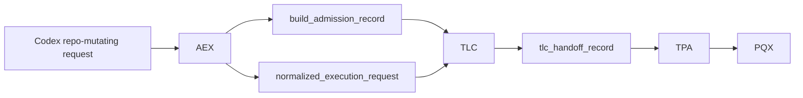

# System Registry (Canonical)

## Core Rule
1. **Single-responsibility ownership:** each governed responsibility has exactly one owning system.
2. **No-duplication rule:** no system may implement, enforce, or silently shadow a responsibility owned by another system.

These rules are hard boundaries for architecture, contracts, and validation.

## Canonical Governed Execution Hierarchy

The governed execution hierarchy is:

**slice → batch → umbrella → roadmap**

### Slice
- Atomic unit of work.
- Executed by PQX.
- Reviewed by RQX.
- Fixes gated by TPA.

### Batch
- Aggregation of slices representing one coherent system seam.
- Must contain multiple slices.
- Ends with:
  - validation
  - review
  - `batch_decision_artifact`

### Umbrella
- Aggregation of batches representing a system phase.
- Must contain multiple batches.
- Ends with:
  - `umbrella_decision_artifact`

### Batch Constraint
A batch **MUST** contain ≥2 slices.
If a batch contains only one slice, it is invalid and must be collapsed into a slice.

### Umbrella Constraint
An umbrella **MUST** contain ≥2 batches.
If an umbrella contains only one batch, it is invalid and must be collapsed into a batch.

### Invariant
All hierarchy levels must aggregate real work. No level may act as a pass-through wrapper.

### BRF + Umbrella execution alignment
- Batch execution flow:
  - Slices → Test → Review → Decision → (Fix or Advance)
- Umbrella execution flow:
  - Batch → Decision
  - Batch → Decision
  - → Umbrella Decision
- No batch advances without:
  - validation
  - review
  - decision artifact
- No umbrella advances without:
  - all batches completed
  - umbrella decision artifact

### Execution Hierarchy Ownership Clarification
- Slice execution → PQX
- Review loop → RQX
- Fix gating → TPA
- Orchestration → TLC
- Roadmap execution control → RDX
- Closure / readiness / promotion → CDE

Batch and umbrella decision artifacts:
- control execution progression only
- **MUST NOT** represent closure, readiness, or promotion authority
- **MUST NOT** substitute for CDE decisions

CDE is the only system allowed to emit:
- `closure_decision_artifact`
- `promotion_readiness_decision`
- `readiness_to_close`

## System Map
- **AEX** — admission and execution exchange boundary for repo-mutating Codex requests
- **PQX** — bounded execution engine
- **HNX** — stage harness (structure + time/continuity semantics)
- **LCE** — lifecycle transition enforcement surface for governed artifacts *(placeholder; control-plane seam)*
- **TPA** — trust/policy application gate on execution inputs and paths
- **MAP** — review artifact mediation and projection bridge
- **RDX** — roadmap selection and execution-loop governance adapter
- **ABX** — artifact bus exchange surface for cross-module artifact transfer *(placeholder; orchestration seam)*
- **DBB** — data backbone surface for canonical metadata/lineage/evaluation/work-item records *(placeholder; shared substrate seam)*
- **FRE** — failure diagnosis and repair planning
- **RIL** — review interpretation and integration
- **RQX** — bounded review queue execution and bounded fix-slice request emission
- **SEL** — enforcement and fail-closed control actions
- **CDE** — closure-state decision authority
- **TLC** — top-level orchestration and routing across subsystems
- **PRG** — program-level planning, priority, and governance
- **SAL** — source authority layer for deterministic source precedence and obligation indexing *(placeholder; non-authoritative governance seam)*
- **SAS** — source authority sync ingestion surface *(placeholder; source retrieval seam)*
- **SHA** — shared authority layer for shared primitive ownership boundaries *(placeholder; shared primitive seam)*
- **RAX** — bounded runtime candidate-signal surface *(placeholder; non-authoritative by design)*
- **SIV** — not currently present in this repository scope (reserved acronym)

## System Definitions

### AEX
- **acronym:** `AEX`
- **full_name:** Admission & Execution eXchange
- **role:** Canonical entry point for all Codex execution requests that may mutate repository state.
- **owns:**
  - execution_admission
  - request_validation
  - execution_classification
  - intake_artifact_creation
  - entrypoint_enforcement
- **consumes:**
  - codex_build_request
  - system context needed for request normalization
- **produces:**
  - build_admission_record
  - normalized_execution_request
  - admission_rejection_record
- **must_not_do:**
  - execute work (PQX-owned)
  - orchestrate workflows (TLC-owned)
  - make trust/policy decisions (TPA-owned)
  - evaluate outputs (RQX/RIL/FRE-owned)
  - issue closure-state decisions (CDE-owned)
  - enforce runtime actions directly (SEL-owned)

### PQX
- **acronym:** `PQX`
- **full_name:** Prompt Queue Execution
- **role:** Executes bounded authorized work slices.
- **owns:**
  - execution
  - execution_state_transitions
  - execution_trace_emission
- **consumes:**
  - codex_pqx_task_wrapper
  - tpa_slice_artifact
  - top_level_conductor_run_artifact
- **produces:**
  - pqx_slice_execution_record
  - pqx_bundle_execution_record
  - pqx_execution_closure_record
- **must_not_do:**
  - perform trust-policy adjudication (TPA-owned)
  - perform failure diagnosis/repair generation (FRE-owned)
  - issue closure-state decisions (CDE-owned)

### HNX
- **acronym:** `HNX`
- **full_name:** Harness eXecution Semantics
- **role:** Owns canonical stage structure and time/continuity semantics for governed workflows.
- **owns:**
  - stage structure semantics
  - checkpoint/resume/async continuity constraints
  - harness-level execution preconditions
- **consumes:**
  - stage_contract
  - checkpoint_contract
  - resume_handoff_contract
- **produces:**
  - stage_continuity_evaluation
  - continuation_contract_validation_record
  - hnx_continuity_guard_result
- **must_not_do:**
  - execute work (PQX-owned)
  - make promotion decisions (CDE/SEL-owned)
  - replace policy allow/deny authority (policy modules + SEL-owned)

### MAP
- **acronym:** `MAP`
- **full_name:** Mediation and Projection
- **role:** Performs mediation/projection formatting only for governed artifacts that are already semantically interpreted by RIL.
- **owns:**
  - mediation_projection_formatting
- **consumes:**
  - review_integration_packet_artifact
  - review_projection_bundle_artifact
- **produces:**
  - mediated_review_projection_artifact
  - projection_view_bundle
- **must_not_do:**
  - reinterpret review semantics (RIL-owned)
  - perform review-loop execution (RQX-owned)
  - make closure or promotion decisions (CDE-owned)

### RDX
- **acronym:** `RDX`
- **full_name:** Roadmap Decision eXchange
- **role:** Governs roadmap-selected batch sequencing and execution-loop readiness handoff.
- **owns:**
  - roadmap_selection_governance
  - batch_sequence_governance
  - execution_loop_readiness_handoff
- **consumes:**
  - roadmap_artifact
  - roadmap_signal_bundle
  - cycle_manifest
- **produces:**
  - roadmap_selection_record
  - execution_loop_readiness_record
  - roadmap_handoff_artifact
- **must_not_do:**
  - execute bounded work (PQX-owned)
  - enforce runtime blocks (SEL-owned)
  - issue closure-state authority decisions (CDE-owned)

### LCE
- **acronym:** `LCE`
- **full_name:** Lifecycle Control Enforcement
- **role:** Placeholder control-plane subsystem for canonical artifact lifecycle transition validation and transition gating.
- **status:** Placeholder (non-authoritative outside lifecycle transition checks)
- **owns:**
  - lifecycle_state_transition_validation
  - transition_required_field_enforcement
  - lifecycle_transition_rejection_on_invalid_state
- **consumes:**
  - lifecycle_state_artifact
  - lifecycle_transition_request
  - evaluation_and_work_item_linkage_artifacts
- **produces:**
  - lifecycle_transition_validation_result
  - lifecycle_violation_record
  - lifecycle_transition_acceptance_record
- **must_not_do:**
  - execute work slices (PQX-owned)
  - reinterpret policy admissibility (TPA-owned)
  - issue closure-state authority decisions (CDE-owned)

### ABX
- **acronym:** `ABX`
- **full_name:** Artifact Bus eXchange
- **role:** Placeholder orchestration subsystem for governed cross-module artifact transfer messaging and transfer validation.
- **status:** Placeholder (non-authoritative transfer seam)
- **owns:**
  - cross_module_artifact_transfer_envelope
  - transfer_message_validation
  - run_linked_handoff_trace_requirements
- **consumes:**
  - source_module_artifact
  - orchestration_flow_definition
  - module_manifest_io_contracts
- **produces:**
  - artifact_bus_message
  - rejected_transfer_record
  - transfer_lineage_link
- **must_not_do:**
  - reinterpret review semantics (RIL-owned)
  - execute work slices (PQX-owned)
  - issue trust/policy admissibility decisions (TPA-owned)

### DBB
- **acronym:** `DBB`
- **full_name:** Data Backbone
- **role:** Placeholder shared-data subsystem defining canonical metadata, lineage, evaluation, and work-item record surfaces for governed artifacts.
- **status:** Placeholder (shared substrate; authority remains with canonical system owners)
- **owns:**
  - canonical_artifact_metadata_shape
  - canonical_lineage_record_shape
  - canonical_evaluation_record_shape
  - canonical_work_item_record_shape
- **consumes:**
  - artifact_emission_records
  - lineage_references
  - evaluation_and_work_item_records
- **produces:**
  - governed_metadata_record
  - governed_lineage_record
  - governed_evaluation_record
  - governed_work_item_record
- **must_not_do:**
  - execute work slices (PQX-owned)
  - decide closure/readiness states (CDE-owned)
  - enforce runtime actions (SEL-owned)

### TPA
- **acronym:** `TPA`
- **full_name:** Trust Policy Application
- **role:** Determines trust/policy admissibility and required execution scope before work runs.
- **owns:**
  - trust_policy_application
  - scope_gating
  - complexity_budgeting
- **consumes:**
  - codex_pqx_task_wrapper
  - source_authority_refresh_receipt
  - complexity_trend
- **produces:**
  - tpa_scope_policy
  - tpa_slice_artifact
  - tpa_observability_summary
- **must_not_do:**
  - execute work slices (PQX-owned)
  - enforce runtime actions directly (SEL-owned)
  - perform closure decisioning (CDE-owned)

### FRE
- **acronym:** `FRE`
- **full_name:** Failure Recovery Engine
- **role:** Diagnoses bounded failures and emits governed repair plans.
- **owns:**
  - failure_diagnosis
  - repair_plan_generation
  - recurrence_prevention_recommendation
- **consumes:**
  - agent_failure_record
  - system_enforcement_result_artifact
  - review_signal_artifact
- **produces:**
  - failure_diagnosis_artifact
  - repair_prompt_artifact
  - recurrence_prevention_record
- **must_not_do:**
  - execute repairs directly (PQX-owned)
  - mutate policy/enforcement state directly (SEL-owned)
  - emit final closure decisions (CDE-owned)

### RIL
- **acronym:** `RIL`
- **full_name:** Review Integration Layer
- **role:** Interprets review outputs into deterministic integration packets and projections.
- **owns:**
  - review_interpretation
  - review_integration
  - review_projection
  - evaluation_interpretation
  - drift_interpretation
  - control_input_interpretation_support
- **consumes:**
  - review_artifact
  - review_signal_artifact
  - review_action_tracker_artifact
- **produces:**
  - review_integration_packet_artifact
  - review_projection_bundle_artifact
  - roadmap_review_projection_artifact
- **must_not_do:**
  - enforce policy decisions (SEL-owned)
  - execute work or repairs (PQX-owned)
  - generate repair plans (FRE-owned)
  - prioritize adoption candidates (PRG-owned)
  - issue policy authority decisions (TPA-owned)
  - decide closure state (CDE-owned)

### RQX
- **acronym:** `RQX`
- **full_name:** Review Queue Executor
- **role:** Executes the bounded review loop over completed execution batches and emits governed review outcomes and bounded fix-slice requests.
- **owns:**
  - review_queue_execution
  - merge_readiness_verdict_emission
  - bounded_fix_slice_request_emission
  - unresolved_post_cycle_operator_handoff_emission
- **consumes:**
  - pqx_bundle_execution_record
  - pqx_slice_execution_record
  - review_request_artifact
  - review_result_artifact
  - validation/test result artifacts
- **produces:**
  - review_result_artifact
  - review_merge_readiness_artifact
  - review_fix_slice_artifact
  - review_operator_handoff_artifact
- **must_not_do:**
  - reinterpret review semantics already owned by RIL
  - own review interpretation semantics (RIL-owned)
  - execute fix slices directly (PQX-owned)
  - perform deep repair diagnosis/planning (FRE-owned)
  - own repair diagnosis/planning responsibilities (FRE-owned)
  - enforce runtime blocks directly (SEL-owned)
  - issue closure-state authority decisions (CDE-owned)

### SEL
- **acronym:** `SEL`
- **full_name:** System Enforcement Layer
- **role:** Enforces hard gates and fail-closed actions across subsystem boundaries.
- **owns:**
  - enforcement
  - fail_closed_blocking
  - promotion_guarding
- **consumes:**
  - tpa_slice_artifact
  - review_control_signal_artifact
  - closure_decision_artifact
- **produces:**
  - system_enforcement_result_artifact
  - enforcement_decision
  - action_trace_record
- **must_not_do:**
  - reinterpret review payload semantics (RIL-owned)
  - reinterpret policy admissibility semantics (TPA-owned)
  - generate repair plans (FRE-owned)
  - orchestrate workflow routing (TLC-owned)

### CDE
- **acronym:** `CDE`
- **full_name:** Closure Decision Engine
- **role:** Sole authoritative owner for closure-state and readiness-to-close decisions from governed evidence.
- **owns:**
  - closure_decisions
  - closure_lock_state
  - bounded_next_step_classification
  - promotion_readiness_decisioning
- **consumes:**
  - review_projection_bundle_artifact
  - review_signal_artifact
  - review_action_tracker_artifact
- **produces:**
  - cde_control_decision_output
  - closure_decision_artifact
- **must_not_do:**
  - execute work (PQX-owned)
  - enforce policy side effects (SEL-owned)
  - generate repair plans (FRE-owned)

### TLC
- **acronym:** `TLC`
- **full_name:** Top Level Conductor
- **role:** Orchestrates subsystem invocation order, cross-system routing, and bounded non-authoritative handoff disposition classification.
- **owns:**
  - orchestration
  - subsystem_routing
  - bounded_cycle_coordination
  - unresolved_handoff_disposition_classification
- **consumes:**
  - build_admission_record
  - normalized_execution_request
  - tlc_handoff_record
  - tpa_slice_artifact
  - system_enforcement_result_artifact
  - closure_decision_artifact
  - review_result_artifact
  - review_merge_readiness_artifact
  - review_operator_handoff_artifact
  - review_handoff_disposition_artifact
- **produces:**
  - tlc_handoff_record
  - top_level_conductor_run_artifact
  - review_handoff_disposition_artifact
- **must_not_do:**
  - execute work slice internals (PQX-owned)
  - perform repair diagnosis/planning (FRE-owned)
  - substitute closure authority (CDE-owned)
  - perform policy admissibility evaluation (TPA-owned)
  - perform review interpretation (RIL-owned)
  - own admission validation authority (AEX-owned)
  - own promotion readiness or closure decision authority (CDE-owned)

### PRG
- **acronym:** `PRG`
- **full_name:** Program Governance
- **role:** Owns program-level objective framing, roadmap alignment, and progress governance.
- **owns:**
  - program_governance
  - roadmap_alignment
  - program_drift_management
  - evaluation_pattern_aggregation
  - recommendation_generation
  - adoption_candidate_prioritization
  - adaptive_readiness_recommendation
- **consumes:**
  - roadmap_signal_bundle
  - roadmap_review_view_artifact
  - batch_delivery_report
- **produces:**
  - program_brief
  - program_feedback_record
  - evaluation_pattern_report
  - policy_change_candidate
  - slice_contract_update_candidate
  - program_alignment_assessment
  - prioritized_adoption_candidate_set
  - adaptive_readiness_record
  - program_roadmap_alignment_result
- **must_not_do:**
  - execute bounded work (PQX-owned)
  - gate execution admission (AEX/TPA-owned)
  - enforce runtime blocks (SEL-owned)
  - interpret review integration packets (RIL-owned)
  - issue closure authority decisions (CDE-owned)
  - issue policy authority decisions (TPA-owned)
  - influence runtime execution authority or admission decisions (PQX/AEX-owned)

### SAL
- **acronym:** `SAL`
- **full_name:** Source Authority Layer
- **role:** Placeholder governance subsystem for deterministic source-authority precedence and source-obligation index surfaces.
- **status:** Placeholder (non-authoritative source-governance surface)
- **owns:**
  - source_authority_precedence_rules
  - source_inventory_index_requirements
  - source_obligation_index_requirements
- **consumes:**
  - source_structured_artifact
  - source_inventory_record
  - obligation_index_record
- **produces:**
  - source_authority_validation_result
  - source_authority_precedence_record
  - source_obligation_trace_record
- **must_not_do:**
  - execute bounded work slices (PQX-owned)
  - issue trust/policy admissibility decisions (TPA-owned)
  - issue closure/promotion decisions (CDE-owned)

### SAS
- **acronym:** `SAS`
- **full_name:** Source Authority Sync
- **role:** Placeholder ingestion subsystem for deterministic retrieve/materialize/index of project-design source artifacts.
- **status:** Placeholder (retrieve/index seam; non-authoritative for downstream decisions)
- **owns:**
  - source_retrieve_sync_execution
  - source_materialization_rules
  - source_sync_completeness_validation
- **consumes:**
  - upstream_source_repository_content
  - source_sync_configuration
  - required_source_manifest
- **produces:**
  - source_raw_copy_record
  - source_structured_artifact
  - source_sync_validation_report
- **must_not_do:**
  - issue closure/readiness decisions (CDE-owned)
  - bypass source precedence rules (SAL-owned)
  - execute repo mutation outside admitted orchestration paths (AEX/TLC-owned)

### SHA
- **acronym:** `SHA`
- **full_name:** Shared Authority
- **role:** Placeholder boundary subsystem defining exclusive ownership for shared primitives used across modules.
- **status:** Placeholder (boundary-definition seam; non-execution subsystem)
- **owns:**
  - shared_primitive_ownership_boundary
  - shared_primitive_redefinition_prohibition
  - shared_layer_manifest_requirements
- **consumes:**
  - module_manifest
  - shared_primitive_definition
  - architecture_boundary_rules
- **produces:**
  - shared_authority_compliance_result
  - shared_boundary_violation_record
  - shared_ownership_reference_map
- **must_not_do:**
  - execute bounded work slices (PQX-owned)
  - perform orchestration routing (TLC-owned)
  - issue closure-state authority decisions (CDE-owned)

### RAX
- **acronym:** `RAX`
- **full_name:** Runtime Assurance eXchange
- **role:** Bounded runtime candidate-signal surface emitting non-authoritative readiness, feedback-loop, and assurance artifacts.
- **status:** Placeholder (explicitly non-authoritative runtime interface)
- **owns:**
  - rax_candidate_signal_emission
  - rax_eval_surface_artifact_emission
  - rax_feedback_loop_trace_linkage
- **consumes:**
  - eval_result
  - eval_summary
  - runtime_trace_evidence
- **produces:**
  - rax_failure_pattern_record
  - rax_failure_eval_candidate
  - rax_feedback_loop_record
  - rax_health_snapshot
  - rax_drift_signal_record
  - rax_unknown_state_record
  - rax_pre_certification_alignment_record
  - rax_control_readiness_record
- **must_not_do:**
  - issue closure, readiness-to-close, or promotion authority decisions (CDE-owned)
  - enforce runtime block/unblock decisions directly (SEL-owned)
  - execute bounded work slices (PQX-owned)

## Control-Prep Artifact Rule (Non-Authoritative)
- The following artifacts are **preparatory only** and **MUST NOT** be treated as authoritative decisions:
  - `control_signal_fusion_record`
  - `prioritized_adoption_candidate_set`
  - `cde_control_decision_input`
  - `tpa_policy_update_input`
  - `control_prep_readiness_record`
- These preparatory artifacts may:
  - fuse signals
  - rank bounded options
  - prepare future authority inputs
  - assess readiness for a future governed cycle
- These preparatory artifacts must **NOT**:
  - authorize closure
  - authorize enforcement
  - authorize policy application
  - substitute for CDE outputs
  - substitute for TPA outputs

## Learning / Detection / Recommendation Artifact Ownership
| Artifact | Canonical owner | Constraint |
| --- | --- | --- |
| `evaluation_summary_artifact` | RIL | Interpretation artifact only; non-authoritative. |
| `execution_observability_artifact` | RIL | Observation/interpretation only; no execution mutation authority. |
| `drift_detection_record` | RIL | Detection artifact only; no direct runtime action. |
| `slice_failure_pattern_record` | RIL | Pattern interpretation only; no repair execution authority. |
| `evaluation_pattern_report` | PRG | Recommendation input only; non-authoritative. |
| `policy_change_candidate` | PRG | Candidate artifact only; requires TPA authority output before policy application. |
| `slice_contract_update_candidate` | PRG | Candidate artifact only; no direct execution effect. |
| `program_alignment_assessment` | PRG | Governance assessment only; non-authoritative for closure/enforcement. |
| `program_roadmap_alignment_result` | PRG | Program alignment output only; no closure authority. |
| `adaptive_readiness_record` | PRG | Recommendation artifact only; cannot substitute for CDE closure/readiness decisions. |

## CDE/TPA Authority Boundary: Prep vs Authority
- **CDE boundary**
  - `cde_control_decision_input` is a non-authoritative preparatory artifact.
  - CDE decision outputs (including `closure_decision_artifact` and `cde_control_decision_output`) are authoritative.
- **TPA boundary**
  - `tpa_policy_update_input` is a non-authoritative preparatory artifact.
  - TPA policy outputs (`allow`, `reject`, `narrow`, `evidence_required`) are authoritative.
- Preparatory artifacts may be consumed by future governed cycles, but may not be treated as authority artifacts themselves.

## Anti-Duplication Table
| Invalid behavior | Why invalid | Canonical owner |
| --- | --- | --- |
| TLC executes work | Orchestration cannot subsume execution responsibility | PQX |
| CDE generates repairs | Closure authority cannot create remediation plans | FRE |
| RIL enforces decisions | Interpretation cannot trigger hard gates | SEL |
| PRG executes work | Program governance cannot run execution slices | PQX |
| SEL rewrites review interpretation | Enforcement cannot reinterpret evidence semantics | RIL |
| SEL rewrites policy interpretation | Enforcement cannot become a second policy engine | TPA |
| TPA emits closure decisions | Trust policy gating cannot decide closure lock state | CDE |
| RQX executes fix slices | Review queue execution cannot subsume execution authority | PQX |
| RQX reinterprets review semantics | Review queue execution cannot redefine review interpretation semantics | RIL |
| RQX generates full repair diagnosis | Bounded review queue execution cannot replace diagnosis/planning ownership | FRE |
| RQX enforces runtime decisions | Review queue execution cannot enforce runtime blocks | SEL |
| RQX issues authoritative closure state | Review queue execution cannot become closure authority | CDE |
| TLC performs admission validation | Orchestrator must not own repo-mutation admission | AEX |
| PQX accepts repo-writing requests directly | Execution system cannot be public repo-write entrypoint | AEX |
| AEX executes work | Admission boundary cannot execute bounded work | PQX |
| AEX decides trust/policy admissibility | Admission boundary cannot own trust-policy authority | TPA |
| PRG emits authoritative closure or gating decisions | Recommendation/planning cannot become decision authority | CDE / TPA |
| RIL ranks adoption candidates | Interpretation layer cannot own program prioritization | PRG |
| TLC emits control decisions from prep artifacts | Orchestration cannot convert preparatory inputs into authority outputs | CDE / TPA |
| Control-prep artifacts treated as final decisions | Preparatory artifacts cannot substitute for authority decisions | CDE / TPA |
| Drift detection directly changes runtime behavior | Detection cannot directly mutate runtime behavior outside governed authority paths | TPA / SEL / PQX via governed cycle |

## Allowed Interaction Graph
- AEX → TLC
- TLC → PQX
- TLC → TPA
- TLC → FRE
- TLC → RIL
- TLC → RQX
- TLC → CDE
- TLC → PRG
- SEL wraps all subsystems as a cross-cutting enforcement boundary
- RQX → RIL
- RQX → FRE
- RQX → TPA (review fix slices must be policy-gated before execution)
- TPA → PQX (only approved tpa_slice_artifact may enter execution)
- RQX → PQX (handoff only via TPA-approved artifacts; no direct execution)
- RQX → TLC (operator handoff disposition classification only; no auto-recursion)
- TLC → review_handoff_disposition_artifact (classification output only; no execution trigger and no closure authority)
- CDE → closure_decision_artifact (readiness-to-close / bounded-next-step / promotion-readiness decisions)
- RIL → CDE
- Placeholder seams (LCE/ABX/DBB/SAL/SAS/SHA/RAX) are non-authoritative and must route final authority decisions through canonical owners above.

## Entry Invariant (Repo-Mutation Admission)
- All Codex execution requests that create or modify repository state MUST enter through **AEX**.
- **AEX** is the only system allowed to invoke **TLC** for repo-mutating work.
- **TLC** MUST validate `build_admission_record` and `normalized_execution_request` (accepted status, repo-write class, resolvable request reference, and trace continuity) before orchestration continues.
- **TLC** MUST formalize admitted repo-write continuation as `tlc_handoff_record` before routing to downstream execution gates.
- **PQX** MUST reject repo-writing execution that lacks AEX admission artifacts plus TLC-mediated lineage.
- `build_admission_record`, `normalized_execution_request`, and `tlc_handoff_record` MUST each include verifiable `authenticity` attestation (issuer, key_id, payload digest, and attestation) and MUST be verified fail-closed at the PQX repo-write lineage boundary.
- Any attempt to invoke **TLC** or **PQX** directly for repo-mutating work without valid AEX/TLC lineage MUST fail closed.

## Pre-PR bounded repair-loop behavior (GHA-008)
- This is a **behavior** over existing systems, not a new system.
- Ownership mapping is fixed:
  - RIL structures failure/test surfaces into governed packets only.
  - FRE diagnoses failure class, emits `failure_repair_candidate_artifact`, and proposes bounded repair scope.
  - CDE is the only authority that may emit `continue_repair_bounded`.
  - TLC only orchestrates bounded retries and terminal-state transitions.
  - PQX is the only execution path for applying repairs and rerunning tests.
  - SEL enforces scope, retry budget, and decision-state boundaries for each repair attempt.

## Serial Multi-Umbrella Execution Rule
- When multiple umbrellas are executed in one governed serial cycle:
  - each umbrella **MUST** fully complete before the next umbrella begins
  - each umbrella **MUST** emit its own `umbrella_decision_artifact`
  - later umbrellas may consume prior umbrella outputs
  - later umbrellas **MUST NOT** mutate prior umbrella outputs
  - any fail-closed stop condition halts the serial cycle unless a bounded permitted fix cycle is explicitly invoked

## Roadmap Design Rules (Registry Alignment Constitution)
1. Every roadmap row **MUST** map to one canonical system owner from this registry.
2. No roadmap row may assign a responsibility to a non-owner.
3. Preparatory rows that produce future authority inputs **MUST** be labeled non-authoritative.
4. Decision rows **MUST** invoke the authoritative decision owner (CDE/TPA), never a recommendation/prep layer.
5. Execution rows **MUST** route execution through PQX.
6. Enforcement rows **MUST** route enforcement through SEL.
7. Repo-mutating rows **MUST** preserve lineage `AEX → TLC → TPA → PQX`.
8. Review-related rows **MUST** distinguish:
   - RQX review-loop execution
   - RIL interpretation/projection
9. Roadmaps **MUST** separate:
   - observe / interpret / recommend / prepare
   - decide / gate / enforce / execute
10. Multi-umbrella roadmap bundles **MUST** preserve complete per-umbrella completion boundaries.
11. Batch and umbrella decision artifacts control progression only and **MUST NOT** substitute for CDE closure authority.
12. New roadmap proposals **MUST** be duplication-checked against this registry before admission.

## System Invariants
1. Execution is owned only by **PQX**.
2. Recovery and repair planning are owned only by **FRE**.
3. Review interpretation is owned only by **RIL**.
4. Closure decisions are owned only by **CDE**.
5. Enforcement is owned only by **SEL**.
6. Orchestration is owned only by **TLC**.
7. Program governance is owned only by **PRG**.
8. Review-loop execution is owned only by **RQX**.
9. Repo-mutation admission is owned only by **AEX**.

## Roadmap Alignment Checklist (Lightweight)
- Does each roadmap row map to exactly one canonical owner?
- Is any preparatory artifact being treated as an authority artifact?
- Does any recommendation layer implicitly decide, gate, or enforce?
- Does any orchestration layer perform execution or policy reasoning?
- Are serial umbrella completion boundaries explicit?
- Are repo-mutation paths preserving `AEX → TLC → TPA → PQX` lineage?
- Are batch/umbrella decision artifacts being misused as closure authority?

## Canonical Repo-Mutation Path

## Placeholder Systems Added
- **LCE** — added because `docs/architecture/lifecycle-enforcement.md` defines a concrete lifecycle transition enforcement seam with canonical transition validation behavior.
- **ABX** — added because `docs/architecture/artifact-bus.md` defines a canonical cross-module artifact transfer surface with required message contracts.
- **DBB** — added because `docs/architecture/data-backbone.md` defines platform-wide governed artifact metadata/lineage/evaluation/work-item substrate behavior.
- **SAL** — added because `docs/architecture/source_authority_layer.md` defines canonical source-authority precedence and index-governance behavior used by roadmap/planning flows.
- **SAS** — added because `docs/architecture/source_authority_sync.md` defines deterministic retrieve/materialize/index behavior with fail-closed completeness checks.
- **SHA** — added because `docs/architecture/shared-authority.md` defines shared primitive ownership boundaries and prohibited redefinition behavior across modules.
- **RAX** — added because this registry already used RAX as a governed runtime boundary and multiple architecture/review surfaces rely on its candidate artifact seam; full definition added to resolve missing registry entry.

## TAX/BAX/CAX Authority Extension (2026-04-13)

### TAX
- **acronym:** `TAX`
- **full_name:** `Termination Authority eXecutor`
- **role:** Determines whether a governed run should complete, continue, repair, freeze, block, or await async signal from validated evidence.
- **owns:**
  - information_sufficiency_evaluation
  - bounded_completion_authority
  - termination_decision_artifacts
- **must_not_do:**
  - enforce_side_effects
  - replace_budget_authority
  - replace_closure_state_owner
  - terminate_on_confidence_alone

### BAX
- **acronym:** `BAX`
- **full_name:** `Budget Authority eXecutor`
- **role:** Determines whether governed execution remains within acceptable cost, quality, and risk bounds.
- **owns:**
  - system_budget_governance
  - merged_budget_status
  - budget_decision_artifacts
- **must_not_do:**
  - terminate_runs_directly
  - enforce_side_effects
  - optimize_for_cost_only
  - replace_closure_state_owner

### CAX
- **acronym:** `CAX`
- **full_name:** `Control Arbitration eXchange`
- **role:** Deterministically composes TAX, BAX, TPA, judgment, replay, trace, drift, and guardrail signals into a single arbitration outcome for CDE consumption.
- **owns:**
  - control_arbitration
  - authority_composition
  - conflict_resolution_precedence
  - cde_arbitration_input_bundle
- **must_not_do:**
  - execute_work
  - enforce_actions
  - replace_CDE
  - replace_TPA
  - emit_final_closure_state

### Governed topology extension
- `AEX -> TLC -> TPA -> PQX -> BAX + TAX -> CAX -> CDE -> SEL`
- **CDE remains sole final closure-state owner.**
