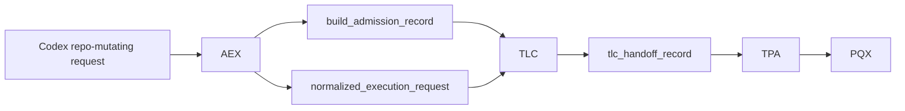

# System Registry (Canonical)

## Core Rule
1. **Single-responsibility ownership:** each governed responsibility has exactly one owning system.
2. **No-duplication rule:** no system may implement, enforce, or silently shadow a responsibility owned by another system.

These rules are hard boundaries for architecture, contracts, and validation.

## System Map
- **AEX** — admission and execution exchange boundary for repo-mutating Codex requests
- **PQX** — bounded execution engine
- **HNX** — stage harness (structure + time/continuity semantics)
- **TPA** — trust/policy application gate on execution inputs and paths
- **MAP** — review artifact mediation and projection bridge
- **RDX** — roadmap selection and execution-loop governance adapter
- **FRE** — failure diagnosis and repair planning
- **RIL** — review interpretation and integration
- **RQX** — bounded review queue execution and bounded fix-slice request emission
- **SEL** — enforcement and fail-closed control actions
- **CDE** — closure-state decision authority
- **TLC** — top-level orchestration and routing across subsystems
- **PRG** — program-level planning, priority, and governance
- **SIV** — not currently present in this repository scope (reserved acronym)

## System Definitions

### AEX
- **acronym:** `AEX`
- **full_name:** Admission & Execution eXchange
- **role:** Canonical entry point for all Codex execution requests that may mutate repository state.
- **owns:**
  - execution_admission
  - request_validation
  - execution_classification
  - intake_artifact_creation
  - entrypoint_enforcement
- **consumes:**
  - codex_build_request
  - system context needed for request normalization
- **produces:**
  - build_admission_record
  - normalized_execution_request
  - admission_rejection_record
- **must_not_do:**
  - execute work (PQX-owned)
  - orchestrate workflows (TLC-owned)
  - make trust/policy decisions (TPA-owned)
  - evaluate outputs (RQX/RIL/FRE-owned)
  - issue closure-state decisions (CDE-owned)
  - enforce runtime actions directly (SEL-owned)

### PQX
- **acronym:** `PQX`
- **full_name:** Prompt Queue Execution
- **role:** Executes bounded authorized work slices.
- **owns:**
  - execution
  - execution_state_transitions
  - execution_trace_emission
- **consumes:**
  - codex_pqx_task_wrapper
  - tpa_slice_artifact
  - top_level_conductor_run_artifact
- **produces:**
  - pqx_slice_execution_record
  - pqx_bundle_execution_record
  - pqx_execution_closure_record
- **must_not_do:**
  - perform trust-policy adjudication (TPA-owned)
  - perform failure diagnosis/repair generation (FRE-owned)
  - issue closure-state decisions (CDE-owned)

### HNX
- **acronym:** `HNX`
- **full_name:** Harness eXecution Semantics
- **role:** Owns canonical stage structure and time/continuity semantics for governed workflows.
- **owns:**
  - stage structure semantics
  - checkpoint/resume/async continuity constraints
  - harness-level execution preconditions
- **must_not_do:**
  - execute work (PQX-owned)
  - make promotion decisions (CDE/SEL-owned)
  - replace policy allow/deny authority (policy modules + SEL-owned)

### MAP
- **acronym:** `MAP`
- **full_name:** Mediation and Projection
- **role:** Translates governed review artifacts into deterministic projections consumed by downstream control surfaces.

### RDX
- **acronym:** `RDX`
- **full_name:** Roadmap Decision eXchange
- **role:** Governs roadmap-selected batch sequencing and execution-loop readiness handoff.

### TPA
- **acronym:** `TPA`
- **full_name:** Trust Policy Application
- **role:** Determines trust/policy admissibility and required execution scope before work runs.
- **owns:**
  - trust_policy_application
  - scope_gating
  - complexity_budgeting
- **consumes:**
  - codex_pqx_task_wrapper
  - source_authority_refresh_receipt
  - complexity_trend
- **produces:**
  - tpa_scope_policy
  - tpa_slice_artifact
  - tpa_observability_summary
- **must_not_do:**
  - execute work slices (PQX-owned)
  - enforce runtime actions directly (SEL-owned)
  - perform closure decisioning (CDE-owned)

### FRE
- **acronym:** `FRE`
- **full_name:** Failure Recovery Engine
- **role:** Diagnoses bounded failures and emits governed repair plans.
- **owns:**
  - failure_diagnosis
  - repair_plan_generation
  - recurrence_prevention_recommendation
- **consumes:**
  - agent_failure_record
  - system_enforcement_result_artifact
  - review_signal_artifact
- **produces:**
  - failure_diagnosis_artifact
  - repair_prompt_artifact
  - recurrence_prevention_record
- **must_not_do:**
  - execute repairs directly (PQX-owned)
  - mutate policy/enforcement state directly (SEL-owned)
  - emit final closure decisions (CDE-owned)

### RIL
- **acronym:** `RIL`
- **full_name:** Review Integration Layer
- **role:** Interprets review outputs into deterministic integration packets and projections.
- **owns:**
  - review_interpretation
  - review_integration
  - review_projection
- **consumes:**
  - review_artifact
  - review_signal_artifact
  - review_action_tracker_artifact
- **produces:**
  - review_integration_packet_artifact
  - review_projection_bundle_artifact
  - roadmap_review_projection_artifact
- **must_not_do:**
  - enforce policy decisions (SEL-owned)
  - execute work or repairs (PQX-owned)
  - decide closure state (CDE-owned)

### RQX
- **acronym:** `RQX`
- **full_name:** Review Queue Executor
- **role:** Executes the bounded review loop over completed execution batches and emits governed review outcomes and bounded fix-slice requests.
- **owns:**
  - review_queue_execution
  - merge_readiness_verdict_emission
  - bounded_fix_slice_request_emission
- **consumes:**
  - pqx_bundle_execution_record
  - pqx_slice_execution_record
  - review_request_artifact
  - review_result_artifact
  - validation/test result artifacts
- **produces:**
  - review_result_artifact
  - review_merge_readiness_artifact
  - review_fix_slice_artifact
- **must_not_do:**
  - reinterpret review semantics already owned by RIL
  - execute fix slices directly (PQX-owned)
  - perform deep repair diagnosis/planning (FRE-owned)
  - enforce runtime blocks directly (SEL-owned)
  - issue closure-state authority decisions (CDE-owned)

### SEL
- **acronym:** `SEL`
- **full_name:** System Enforcement Layer
- **role:** Enforces hard gates and fail-closed actions across subsystem boundaries.
- **owns:**
  - enforcement
  - fail_closed_blocking
  - promotion_guarding
- **consumes:**
  - tpa_slice_artifact
  - review_control_signal_artifact
  - closure_decision_artifact
- **produces:**
  - system_enforcement_result_artifact
  - enforcement_decision
  - action_trace_record
- **must_not_do:**
  - reinterpret review payload semantics (RIL-owned)
  - generate repair plans (FRE-owned)
  - orchestrate workflow routing (TLC-owned)

### CDE
- **acronym:** `CDE`
- **full_name:** Closure Decision Engine
- **role:** Produces authoritative closure-state decisions from governed evidence.
- **owns:**
  - closure_decisions
  - closure_lock_state
  - bounded_next_step_classification
- **consumes:**
  - review_projection_bundle_artifact
  - review_signal_artifact
  - review_action_tracker_artifact
- **produces:**
  - closure_decision_artifact
- **must_not_do:**
  - execute work (PQX-owned)
  - enforce policy side effects (SEL-owned)
  - generate repair plans (FRE-owned)

### TLC
- **acronym:** `TLC`
- **full_name:** Top Level Conductor
- **role:** Orchestrates subsystem invocation order and cross-system routing.
- **owns:**
  - orchestration
  - subsystem_routing
  - bounded_cycle_coordination
- **consumes:**
  - build_admission_record
  - normalized_execution_request
  - tlc_handoff_record
  - tpa_slice_artifact
  - system_enforcement_result_artifact
  - closure_decision_artifact
- **produces:**
  - tlc_handoff_record
  - top_level_conductor_run_artifact
- **must_not_do:**
  - execute work slice internals (PQX-owned)
  - perform repair diagnosis/planning (FRE-owned)
  - substitute closure authority (CDE-owned)

### PRG
- **acronym:** `PRG`
- **full_name:** Program Governance
- **role:** Owns program-level objective framing, roadmap alignment, and progress governance.
- **owns:**
  - program_governance
  - roadmap_alignment
  - program_drift_management
- **consumes:**
  - roadmap_signal_bundle
  - roadmap_review_view_artifact
  - batch_delivery_report
- **produces:**
  - program_brief
  - program_feedback_record
  - program_roadmap_alignment_result
- **must_not_do:**
  - execute bounded work (PQX-owned)
  - enforce runtime blocks (SEL-owned)
  - interpret review integration packets (RIL-owned)

## Anti-Duplication Table
| Invalid behavior | Why invalid | Canonical owner |
| --- | --- | --- |
| TLC executes work | Orchestration cannot subsume execution responsibility | PQX |
| CDE generates repairs | Closure authority cannot create remediation plans | FRE |
| RIL enforces decisions | Interpretation cannot trigger hard gates | SEL |
| PRG executes work | Program governance cannot run execution slices | PQX |
| SEL rewrites review interpretation | Enforcement cannot reinterpret evidence semantics | RIL |
| TPA emits closure decisions | Trust policy gating cannot decide closure lock state | CDE |
| RQX executes fix slices | Review queue execution cannot subsume execution authority | PQX |
| RQX reinterprets review semantics | Review queue execution cannot redefine review interpretation semantics | RIL |
| RQX generates full repair diagnosis | Bounded review queue execution cannot replace diagnosis/planning ownership | FRE |
| RQX enforces runtime decisions | Review queue execution cannot enforce runtime blocks | SEL |
| RQX issues authoritative closure state | Review queue execution cannot become closure authority | CDE |
| TLC performs admission validation | Orchestrator must not own repo-mutation admission | AEX |
| PQX accepts repo-writing requests directly | Execution system cannot be public repo-write entrypoint | AEX |
| AEX executes work | Admission boundary cannot execute bounded work | PQX |
| AEX decides trust/policy admissibility | Admission boundary cannot own trust-policy authority | TPA |

## Allowed Interaction Graph
- AEX → TLC
- TLC → PQX
- TLC → TPA
- TLC → FRE
- TLC → RIL
- TLC → RQX
- TLC → CDE
- TLC → PRG
- SEL wraps all subsystems as a cross-cutting enforcement boundary
- RQX → RIL
- RQX → FRE
- RQX → TPA (review fix slices must be policy-gated before execution)
- TPA → PQX (only approved tpa_slice_artifact may enter execution)
- RQX → PQX (handoff only via TPA-approved artifacts; no direct execution)
- RIL → CDE

## Entry Invariant (Repo-Mutation Admission)
- All Codex execution requests that create or modify repository state MUST enter through **AEX**.
- **AEX** is the only system allowed to invoke **TLC** for repo-mutating work.
- **TLC** MUST validate `build_admission_record` and `normalized_execution_request` (accepted status, repo-write class, resolvable request reference, and trace continuity) before orchestration continues.
- **TLC** MUST formalize admitted repo-write continuation as `tlc_handoff_record` before routing to downstream execution gates.
- **PQX** MUST reject repo-writing execution that lacks AEX admission artifacts plus TLC-mediated lineage.
- Any attempt to invoke **TLC** or **PQX** directly for repo-mutating work without valid AEX/TLC lineage MUST fail closed.

## Pre-PR bounded repair-loop behavior (GHA-008)
- This is a **behavior** over existing systems, not a new system.
- Ownership mapping is fixed:
  - RIL structures failure/test surfaces into governed packets only.
  - FRE diagnoses failure class, emits `failure_repair_candidate_artifact`, and proposes bounded repair scope.
  - CDE is the only authority that may emit `continue_repair_bounded`.
  - TLC only orchestrates bounded retries and terminal-state transitions.
  - PQX is the only execution path for applying repairs and rerunning tests.
  - SEL enforces scope, retry budget, and decision-state boundaries for each repair attempt.

## System Invariants
1. Execution is owned only by **PQX**.
2. Recovery and repair planning are owned only by **FRE**.
3. Review interpretation is owned only by **RIL**.
4. Closure decisions are owned only by **CDE**.
5. Enforcement is owned only by **SEL**.
6. Orchestration is owned only by **TLC**.
7. Program governance is owned only by **PRG**.
8. Review-loop execution is owned only by **RQX**.
9. Repo-mutation admission is owned only by **AEX**.

## Canonical Repo-Mutation Path

